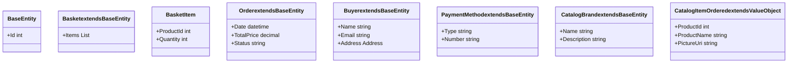

# 1. Domain Model

## Relevant Source Files
* `tests/UnitTests/ApplicationCore/Services/BasketServiceTests/TransferBasket.cs`
* `src/ApplicationCore/Entities/BaseEntity.cs`
* `src/ApplicationCore/Entities/BasketAggregate/Basket.cs`
* `src/ApplicationCore/Entities/BasketAggregate/BasketItem.cs`
* `src/ApplicationCore/Entities/BuyerAggregate/Buyer.cs`
* `src/ApplicationCore/Entities/BuyerAggregate/PaymentMethod.cs`
* `src/ApplicationCore/Entities/CatalogBrand.cs`
* `src/ApplicationCore/Entities/CatalogItem.cs`
* `src/ApplicationCore/Entities/CatalogType.cs`
* `src/ApplicationCore/Entities/OrderAggregate/Order.cs`

## Purpose and Scope

The Domain Model is the foundation of our application, representing the business logic and entities that make up our system. This module defines the core concepts, such as Orders, BasketItems, Buyers, PaymentMethods, CatalogBrands, and more.

The purpose of this module is to provide a clear and well-defined model of the domain, which can be used by other modules to communicate and integrate with each other. The scope includes defining entities, value objects, and aggregates that represent the business logic of our application.

## Entities

Entities are concrete representations of real-world concepts or abstract ideas that have their own identity. In our Domain Model, we have several types of entities:

### Basket

The Basket entity represents a collection of items that a buyer has added to their cart. It is an aggregate root, meaning it can be used as the primary key for other aggregates.

```csharp
src/ApplicationCore/Entities/BasketAggregate/Basket.cs:5-12
```

### Order

The Order entity represents a transaction between a buyer and our application, capturing details such as order date, total price, and status. It is an aggregate root, meaning it can be used as the primary key for other aggregates.

```csharp
src/ApplicationCore/Entities/OrderAggregate/Order.cs:5-15
```

### Buyer

The Buyer entity represents a real-world person or organization that interacts with our application. It has its own identity and is associated with orders, payment methods, and addresses.

```csharp
src/ApplicationCore/Entities/BuyerAggregate/Buyer.cs:5-20
```

### PaymentMethod

The PaymentMethod entity represents a way for buyers to pay for their orders, such as credit cards or PayPal accounts. It is an aggregate root, meaning it can be used as the primary key for other aggregates.

```csharp
src/ApplicationCore/Entities/BuyerAggregate/PaymentMethod.cs:5-18
```

### CatalogBrand

The CatalogBrand entity represents a well-known brand that produces products in our catalog. It is an aggregate root, meaning it can be used as the primary key for other aggregates.

```csharp
src/ApplicationCore/Entities/CatalogBrand.cs:5-15
```

## Value Objects

Value objects are immutable objects that have their own identity and can be compared using equality operators. In our Domain Model, we have several types of value objects:

### Address

The Address value object represents a physical location with street address, city, state, country, and zip code.

```csharp
src/ApplicationCore/Entities/OrderAggregate/Address.cs:3-26
```

### CatalogItemOrdered

The CatalogItemOrdered value object represents an item in the catalog that has been ordered by a buyer. It includes details such as product name, picture URL, and catalog ID.

```csharp
src/ApplicationCore/Entities/OrderAggregate/CatalogItemOrdered.cs:9-28
```

## Aggregates

Aggregates are groups of entities that work together to perform a specific task or operation. In our Domain Model, we have several types of aggregates:

### BasketAggregate

The BasketAggregate is an aggregate root that represents a collection of items in the basket.

```csharp
src/ApplicationCore/Entities/BasketAggregate/Basket.cs:5-12
```

### OrderAggregate

The OrderAggregate is an aggregate root that represents a transaction between a buyer and our application.

```csharp
src/ApplicationCore/Entities/OrderAggregate/Order.cs:5-15
```

## Integration with Other Components

The Domain Model interacts with other components such as services, repositories, and controllers to perform various operations. For example:

* The BasketService uses the BasketAggregate to manage items in the basket.
* The OrderService uses the OrderAggregate to process orders and update order status.

### Class Diagram


This diagram shows the relationships between entities and aggregates, as well as their attributes and methods.

---

**Navigation:**
[← Table of Contents](index.md) | [1.1. Entities →](1.1-entities.md)

**In this section:**
- [1.1. Entities](1.1-entities.md)
- [1.2. Value Objects](1.2-value-objects.md)