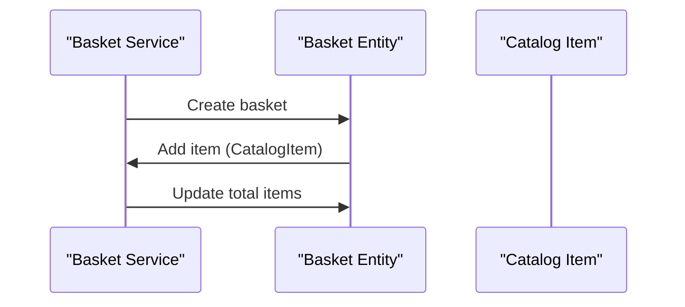

# 1.1. Entities

## Relevant Source Files
* `src/ApplicationCore/Entities/BaseEntity.cs`
* `src/ApplicationCore/Entities/CatalogBrand.cs`
* `src/ApplicationCore/Entities/CatalogItem.cs`
* `src/ApplicationCore/Entities/CatalogType.cs`
* `src/ApplicationCore/Entities/OrderAggregate/Address.cs`
* `src/ApplicationCore/Entities/OrderAggregate/CatalogItemOrdered.cs`
* `src/ApplicationCore/Entities/BasketAggregate/Basket.cs`
* `src/ApplicationCore/Entities/BasketAggregate/BasketItem.cs`
* `src/ApplicationCore/Entities/BuyerAggregate/Buyer.cs`
* `src/ApplicationCore/Entities/BuyerAggregate/PaymentMethod.cs`

## Purpose and Scope
The entities module in the eShopWeb application represents a set of classes that encapsulate domain concepts, such as products, orders, and payment methods. This module provides a foundation for building a robust and scalable e-commerce system.

In this documentation, we will focus on the design and implementation of the entities module, highlighting key patterns, relationships, and integration points.

### Domain Model
The entities module is built around a domain model that defines the core concepts and relationships within the application. This includes classes such as `BaseEntity`, which provides a common base class for all entities, and more specific classes like `CatalogItem` and `Order`.

```csharp
namespace Microsoft.eShopWeb.ApplicationCore.Entities;
public abstract class BaseEntity : IEquatable<BaseEntity>
{
    public Guid Id { get; set; }
}
```

### Value Objects
Value objects in the entities module represent immutable data structures that encapsulate specific domain concepts. Examples include `Address` and `PaymentMethod`.

```csharp
namespace Microsoft.eShopWeb.ApplicationCore.Entities.OrderAggregate;
public class Address : IEquatable<Address>
{
    public string Street { get; set; }
    public string City { get; set; }
    public string ZipCode { get; set; }
}
```

## Integration with Other Components

The entities module interacts closely with other components in the application, such as the services and repositories. The `BasketService`, for example, relies on the `Basket` entity to manage shopping cart functionality.



## Flowchart TD
The entities module also plays a crucial role in the order lifecycle, from creation to management. This flow chart illustrates the key steps involved.

```mermaid
flowchart TD
    Start[Start Order] --> CreateOrder[Create Order]
    CreateOrder-->AddItem[Add Item to Order]
    AddItem-->>UpdateTotal[Update Total Items]
    UpdateTotal-->ProcessPayment[Process Payment]
    ProcessPayment-->ConfirmOrder[Confirm Order]
```

Note that the entities module is designed to be extensible and scalable, with a focus on maintaining a clear separation of concerns and leveraging established patterns and principles.

---

**Navigation:**
[← Table of Contents](index.md) | [← 1. Domain Model](1-domain-model.md) | [1.2. Value Objects →](1.2-value-objects.md)

**In this section:**
- [1.2. Value Objects](1.2-value-objects.md)