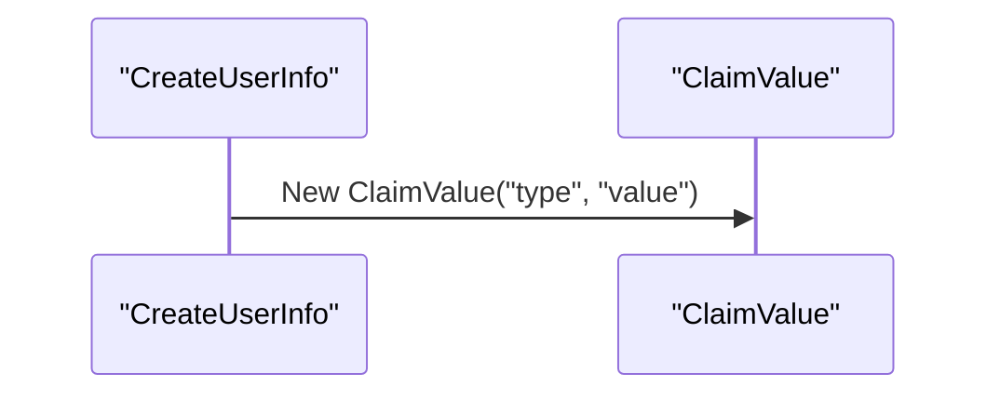

# 1.2. Value Objects

## Relevant Source Files
- `src/BlazorAdmin/Authorization/ClaimValue.cs`
- `src/Web/Controllers/UserController.cs`
- `src/PublicApi/AuthEndpoints/AuthenticateEndpoint.ClaimValue.cs`

## Purpose and Scope

The ClaimValue class is a value object that represents a specific claim type and its associated value. This module plays a crucial role in the overall application architecture, as it enables the authentication and authorization process.

The design of this module revolves around the concept of immutability, ensuring that the value objects are created once and remain unchanged throughout their lifecycle. This approach allows for thread-safety and makes the code more predictable and maintainable.

## Value Object Implementation

### Construction and Properties

```csharp
public class ClaimValue
{
    public ClaimValue()
    {
    }

    public ClaimValue(string type, string value)
    {
        Type = type;
        Value = value;
    }

    public string Type { get; set; }
    public string Value { get; set; }
}
```

The `ClaimValue` class has a constructor that takes two parameters: `type` and `value`. These properties are immutable, meaning they cannot be changed once the object is created. This ensures that the value objects remain consistent throughout their lifetime.

### Instantiation

The `CreateUserInfo` method instantiates a new `ClaimValue` object:


This diagram shows the sequence of events when creating a new `ClaimValue` instance.

## Integration with Other Components

The `ClaimValue` class is used in conjunction with other components, such as the `UserController`, to authenticate and authorize users. The `UserController` relies on the `ClaimValue` object to retrieve and validate user claims.

For more details on the integration between these components, see [2. Core Services](2-core-services.md) and [4. Web Application](4-web-application.md).

---

**Navigation:**
[← Table of Contents](index.md) | [← 1.1. Entities](1.1-entities.md) | [2. Core Services →](2-core-services.md)

**In this section:**
- [1.1. Entities](1.1-entities.md)