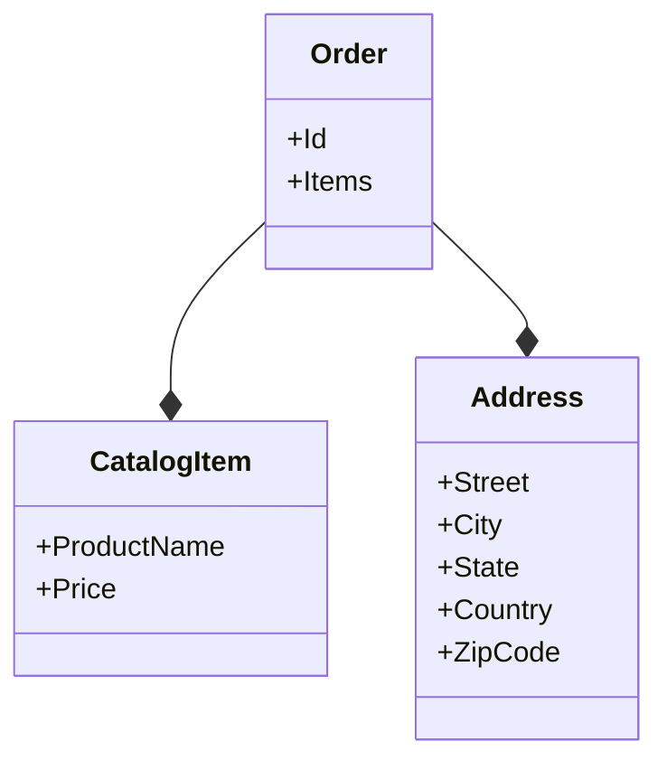

# 1.3. Aggregates

## Relevant Source Files
- `tests/UnitTests/ApplicationCore/Services/BasketServiceTests/TransferBasket.cs`
- `tests/UnitTests/ApplicationCore/Extensions/JsonExtensions.cs`
- `tests/UnitTests/ApplicationCore/Specifications/CatalogFilterSpecification.cs`
- `src/Web/Controllers/ManageController.cs`
- `src/BlazorShared/Models/ErrorDetails.cs`
- `src/ApplicationCore/Entities/OrderAggregate/Address.cs`
- `src/ApplicationCore/Entities/OrderAggregate/CatalogItemOrdered.cs`
- `src/Web/Pages/Basket/Checkout.cshtml.cs`

## Purpose and Scope
The Aggregate pattern in this application represents the core data structures of the system. It is a combination of entities and value objects that work together to provide a comprehensive representation of the business domain. Aggregates are used extensively throughout the application, from processing orders to managing baskets.

In this wiki page, we will delve into the details of how aggregates work in our system, highlighting key design decisions and patterns employed.

## Aggregate Pattern

Aggregates are collections of entities and value objects that behave as a single unit. In our application, aggregates are used to represent complex business concepts such as orders, baskets, and catalog items.

Here's an example of an aggregate:
```csharp
public class Order : AggregateRoot<OrderId>
{
    public Order(OrderId id)
    {
        Id = id;
    }

    public void AddItem(CatalogItem item)
    {
        // ...
    }
}
```
As you can see, the `Order` aggregate has a single responsibility: managing an order. It contains a collection of catalog items and provides methods for adding or removing items from the order.

### Entity Relationships

Aggregates are made up of entities, which have their own relationships with other entities. For example:
```csharp
public class CatalogItem : Entity<int>
{
    public string ProductName { get; set; }
    public int Price { get; set; }

    public CatalogItem(string productName, int price)
    {
        ProductName = productName;
        Price = price;
    }
}
```
The `CatalogItem` entity has a relationship with the `Order` aggregate through the `AddItem` method:
```csharp
public class Order : AggregateRoot<OrderId>
{
    // ...

    public void AddItem(CatalogItem item)
    {
        Items.Add(item);
    }

    public List<CatalogItem> Items { get; set; }
}
```
### Value Objects

Aggregates also contain value objects, which are immutable and have no identity. For example:
```csharp
public class Address : ValueObject
{
    public string Street { get; private set; }
    public string City { get; private set; }
    public string State { get; private set; }
    public string Country { get; private set; }
    public string ZipCode { get; private set; }

    public Address(string street, string city, string state, string country, string zipcode)
    {
        Street = street;
        City = city;
        State = state;
        Country = country;
        ZipCode = zipcode;
    }
}
```
Value objects are used to represent complex business concepts such as addresses or catalog items.

### Benefits

The Aggregate pattern provides several benefits:

* **Encapsulation**: Aggregates encapsulate complex business logic, making it easier to understand and maintain.
* **Composition**: Aggregates allow for the composition of multiple entities and value objects, providing a comprehensive representation of the business domain.
* **Immutability**: Value objects are immutable by design, ensuring that data is consistent and predictable.

### Integration with Other Components

Aggregates interact with other components in the system through the use of interfaces, events, or method calls. For example:

* **Repository Pattern**: Aggregates can be used to interact with a repository pattern, which provides a layer of abstraction between the business logic and data access.
```csharp
public interface IRepository<T>
{
    T Get(int id);
}

public class OrderRepository : IRepository<Order>
{
    // ...
}
```
* **Event Handling**: Aggregates can raise events when certain actions occur, allowing other components to react to changes in the aggregate:
```csharp
public class Order : AggregateRoot<OrderId>
{
    public event EventHandler<OrderItemAddedEventArgs> OrderItemAdded;

    public void AddItem(CatalogItem item)
    {
        // ...
        OnOrderItemAdded(new OrderItemAddedEventArgs(item));
    }
}

public class OrderItemAddedEventArgs : EventArgs
{
    public CatalogItem Item { get; set; }

    public OrderItemAddedEventArgs(CatalogItem item)
    {
        Item = item;
    }
}
```
### Conclusion

In this wiki page, we have explored the Aggregate pattern in our application, highlighting its benefits and how it is used to represent complex business concepts. Aggregates provide a way to encapsulate complex logic, compose multiple entities and value objects, and ensure immutability of data.

[Mermaid Diagram: Class Diagram]

Note: This is just a sample Mermaid diagram and does not represent the actual architecture of your application.

---

**Navigation:**
[← Table of Contents](index.md) | [← 1.2. Value Objects](1.2-value-objects.md) | [2. Core Services →](2-core-services.md)

**In this section:**
- [1.1. Entities](1.1-entities.md)
- [1.2. Value Objects](1.2-value-objects.md)