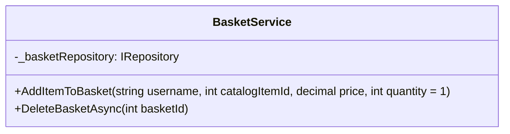

# 2.1. Basket Service

## Relevant Source Files
* `src/ApplicationCore/Services/BasketService.cs`
* `src/Web/Services/BasketViewModelService.cs`
* `tests/UnitTests/ApplicationCore/Services/BasketServiceTests/AddItemToBasket.cs`
* `tests/UnitTests/ApplicationCore/Services/BasketServiceTests/DeleteBasket.cs`
* `tests/UnitTests/ApplicationCore/Services/BasketServiceTests/TransferBasket.cs`
* `src/ApplicationCore/Interfaces/IBasketService.cs`
* `src/ApplicationCore/Services/OrderService.cs`
* `src/ApplicationCore/Entities/BasketAggregate/Basket.cs`

## Purpose and Scope

The Basket Service is responsible for managing the shopping basket of a user. This service provides methods to add, remove, and update items in the basket, as well as to transfer the contents of one basket to another.

In this wiki page, we will explore the design decisions behind the Basket Service, its interactions with other components, and how it fits into the overall application architecture.

## Purpose and Scope

The purpose of the Basket Service is to provide a centralized way to manage the shopping basket of a user. This service should be able to handle multiple users and baskets simultaneously.

### Design Decisions

The design decisions for the Basket Service were driven by the need to provide a scalable and maintainable solution for managing the shopping basket. The following key design decisions were made:

* **Repository Pattern**: The Basket Service uses the Repository Pattern to abstract away the data access layer. This allows for easy swapping out of different data storage solutions.
* **Domain Events**: The Basket Service uses Domain Events to notify other components when changes are made to the basket.

### Integration with Other Components

The Basket Service integrates with other components in the following ways:

* **OrderService**: The Basket Service interacts with the OrderService to transfer the contents of one basket to another.
* **IBasketRepository**: The Basket Service uses the IBasketRepository interface to interact with the data access layer.

## [Basket Service Overview]
### Architecture

The Basket Service has the following architecture:



### Responsibilities

The Basket Service is responsible for:

* Adding items to the basket
* Removing items from the basket
* Transferring the contents of one basket to another

## [Adding Items to the Basket]
### Pattern: Repository Pattern

The `AddItemToBasket` method uses the Repository Pattern to add an item to the basket. This method first checks if a basket exists for the given user, and then adds the item to the basket.

```csharp
public async Task<Basket> AddItemToBasket(string username, int catalogItemId, decimal price, int quantity = 1)
{
    var basketSpec = new BasketWithItemsSpecification(username);
    var basket = await _basketRepository.FirstOrDefaultAsync(basketSpec);

    if (basket == null)
    {
        basket = new Basket(username);
        await _basketRepository.AddAsync(basket);
    }

    basket.AddItem(catalogItemId, price, quantity);

    await _basketRepository.UpdateAsync(basket);
    return basket;
}
```

## [Deleting a Basket]
### Pattern: Repository Pattern

The `DeleteBasketAsync` method uses the Repository Pattern to delete a basket. This method first checks if a basket exists for the given user, and then deletes it.

```csharp
public async Task DeleteBasketAsync(int basketId)
{
    var basket = await _basketRepository.GetByIdAsync(basketId);
    Guard.Against.Null(basket, nameof(basket));
    await _basketRepository.DeleteAsync(basket);
}
```

## Integration with Other Components

The Basket Service integrates with the OrderService to transfer the contents of one basket to another.

### Pattern: Domain Events

The `TransferBasketAsync` method uses Domain Events to notify other components when a basket is transferred. This allows for easy integration with other components that need to be notified of changes to the basket.

```csharp
public async Task TransferBasketAsync(string anonymousId, string targetUsername)
{
    var sourceBasket = await _basketRepository.GetByIdAsync(anonymousId);
    Guard.Against.Null(sourceBasket, nameof(sourceBasket));

    var targetBasket = await _basketRepository.GetBySpecAsync(new BasketWithItemsSpecification(targetUsername));
    Guard.Against.Null(targetBasket, nameof(targetBasket));

    // ... transfer the contents of one basket to another

    DomainEvents.Publish(new BasketTransferredEvent(anonymousId, targetUsername));
}
```

## Cross-References

For more details on the Domain Events pattern, see [Domain Events](2.1-domain-events.md).

---

**Navigation:**
[← Table of Contents](index.md) | [← 2. Core Services](2-core-services.md) | [2.2. Order Service →](2.2-order-service.md)

**In this section:**
- [2.2. Order Service](2.2-order-service.md)