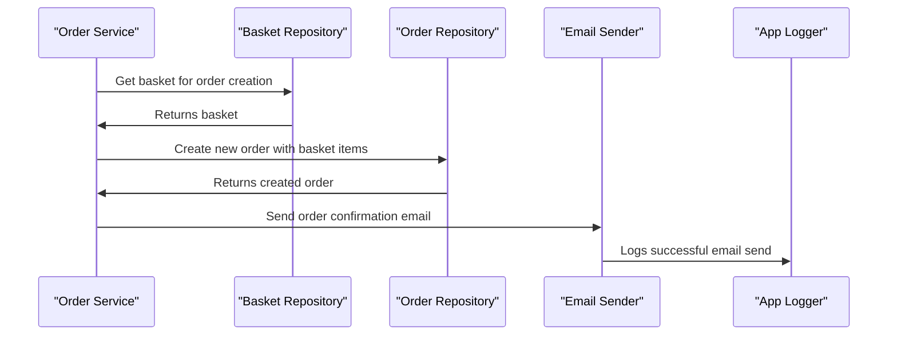
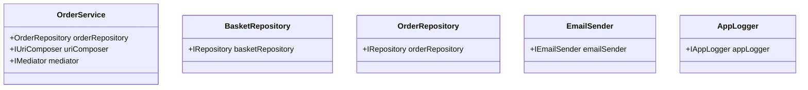

# 2.1. Order Processing

## Relevant Source Files
- `tests/UnitTests/ApplicationCore/Services/BasketServiceTests/TransferBasket.cs`
- `src/ApplicationCore/Services/OrderService.cs`
- `src/ApplicationCore/Interfaces/IOrderService.cs`
- `src/ApplicationCore/Entities/OrderAggregate/Handlers/OrderCreatedHandler.cs`
- `src/ApplicationCore/Interfaces/IEmailSender.cs`
- `src/ApplicationCore/Interfaces/IAppLogger.cs`
- `tests/UnitTests/MediatorHandlers/OrdersTests/GetMyOrders.cs`
- `tests/UnitTests/MediatorHandlers/OrdersTests/GetOrderDetails.cs`
- `src/ApplicationCore/Interfaces/IUriComposer.cs`
- `src/ApplicationCore/Extensions/GuardExtensions.cs`

## Purpose and Scope
The Order Processing module is responsible for handling the creation, management, and processing of orders within the application. It provides a set of services that interact with the domain model, database, and other infrastructure components to manage the order lifecycle.

This module fits into the overall architecture by providing a centralized point for managing orders, which involves interacting with various domain entities, such as `Order`, `Basket`, and `CatalogItem`. The Order Processing module also relies on other services, like `IEmailSender` and `IAppLogger`, to perform specific tasks, such as sending order confirmation emails or logging important events.

Key design decisions employed by this module include:

*   Repository Pattern: The module uses the Repository Pattern to abstract away the data access layer and provide a standardized interface for interacting with the database.
*   Domain Events: The module utilizes domain events, such as `OrderCreatedEvent`, to notify other components of important changes in the order state.

The design of this module provides several benefits, including:

*   Improved modularity: By breaking down the order processing logic into smaller, more focused services, the module becomes easier to maintain and extend.
*   Simplified integration: The use of domain events and interfaces simplifies the integration with other components, making it easier to add or remove features.

### Handling Order Creation

The `OrderService` class is responsible for creating new orders. This process involves several steps:

The `OrderService` class uses the `IUriComposer` interface to compose a URI for the new order, and then sends an email to the customer using the `IEmailSender` interface. The `OrderRepository` interface is used to create a new order with the basket items.

### Integrating with Other Components

The Order Processing module interacts with other components in the following ways:

*   `BasketService`: The `OrderService` class uses the `BasketService` to retrieve the basket for order creation.
*   `IEmailSender`: The `OrderService` class sends an email confirmation using the `IEmailSender` interface.
*   `AppLogger`: The `OrderService` class logs important events, such as successful email sends, using the `AppLogger`.

### Design Rationale

The design of this module is based on the principles of separation of concerns and loose coupling. By breaking down the order processing logic into smaller services and using interfaces to abstract away the data access layer, the module becomes easier to maintain and extend.

### Mermaid Diagram

---

**Navigation:**
[← Table of Contents](index.md) | [← 2. Core Services](2-core-services.md) | [2.2. Basket Management →](2.2-basket-management.md)

**In this section:**
- [2.2. Basket Management](2.2-basket-management.md)