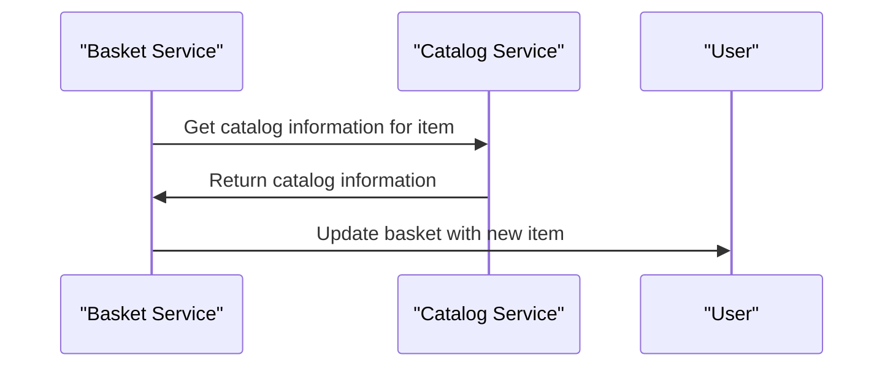

# 2.2. Basket Management

## Relevant Source Files
- `tests/UnitTests/ApplicationCore/Services/BasketServiceTests/TransferBasket.cs`
- `src/ApplicationCore/Services/BasketService.cs`
- `src/Web/Services/BasketViewModelService.cs`
- `src/Infrastructure/Data/Config/BasketConfiguration.cs`
- `src/Infrastructure/Data/Config/BasketItemConfiguration.cs`
- `src/Infrastructure/Data/Queries/BasketQueryService.cs`
- `src/ApplicationCore/Interfaces/IBasketQueryService.cs`
- `src/ApplicationCore/Interfaces/IBasketService.cs`
- `tests/IntegrationTests/Repositories/BasketRepositoryTests/SetQuantities.cs`
- `tests/UnitTests/ApplicationCore/Services/BasketServiceTests/AddItemToBasket.cs`

## Purpose and Scope

The Basket Management module is responsible for managing the application's basket data structure. This module provides services to create, update, and delete baskets, as well as manage basket items. The purpose of this module is to ensure that the basket data is consistent and up-to-date across the entire application.

This module fits into the overall application architecture by providing a central point for managing basket-related data. It interacts with other modules, such as the Catalog module, to retrieve catalog information and update the basket accordingly.

The Basket Management module employs several key design decisions and patterns, including:

* Repository Pattern: The module uses the Repository pattern to abstract away the underlying data storage mechanism.
* Specification Pattern: The module uses the Specification pattern to define complex queries for retrieving basket items.
* Dependency Injection: The module uses dependency injection to decouple itself from the underlying data storage mechanism.

The benefits of this design include improved modularity, scalability, and maintainability. By encapsulating the logic for managing baskets within a single module, we can easily extend or modify the behavior without affecting other parts of the application.

## Basket Management Services

### Creating and Managing Baskets

The `BasketService` class is responsible for creating, updating, and deleting baskets. It provides methods such as `CreateBasketAsync`, `UpdateBasketAsync`, and `DeleteBasketAsync`.

```csharp
public class BasketService : IBasketService
{
    private readonly IRepository<Basket> _basketRepository;

    public BasketService(IRepository<Basket> basketRepository,
        IAppLogger<BasketService> logger)
    {
        _basketRepository = basketRepository;
        _logger = logger;
    }

    public async Task<Basket> CreateBasketAsync(int userId)
    {
        // implementation
    }
}
```

### Managing Basket Items

The `BasketItemService` class is responsible for managing basket items. It provides methods such as `AddItemToBasketAsync`, `RemoveItemFromBasketAsync`, and `UpdateItemQuantityAsync`.

```csharp
public class BasketItemService : IBasketItemService
{
    private readonly IRepository<BasketItem> _basketItemRepository;

    public BasketItemService(IRepository<BasketItem> basketItemRepository,
        IAppLogger<BasketItemService> logger)
    {
        _basketItemRepository = basketItemRepository;
        _logger = logger;
    }

    public async Task AddItemToBasketAsync(int basketId, int itemId)
    {
        // implementation
    }
}
```

## Integration with Other Components

The Basket Management module interacts with other modules, such as the Catalog module, to retrieve catalog information and update the basket accordingly. For example, when a user adds an item to their basket, the `BasketService` class will call the `CatalogService` class to retrieve the catalog information for that item.



The data flow between the Basket Management module and other modules is as follows:

* The `BasketService` class calls the `CatalogService` class to retrieve catalog information.
* The `CatalogService` class returns the catalog information to the `BasketService` class.
* The `BasketService` class updates the basket with the new item.

Note that this is a simplified example and actual implementation may vary depending on the requirements of the application.

---

**Navigation:**
[← Table of Contents](index.md) | [← 2.1. Order Processing](2.1-order-processing.md) | [3. Data Access →](3-data-access.md)

**In this section:**
- [2.1. Order Processing](2.1-order-processing.md)