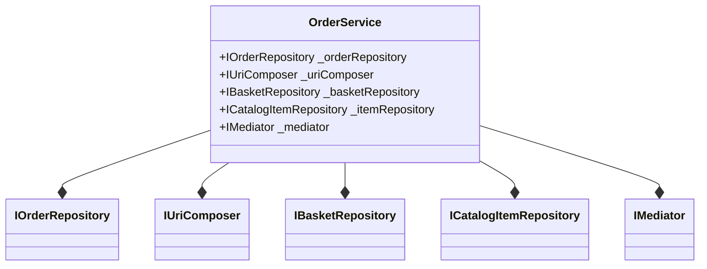

# 2.2. Order Service

## Relevant Source Files
- `src/ApplicationCore/Services/OrderService.cs`
- `src/ApplicationCore/Interfaces/IOrderService.cs`
- `src/ApplicationCore/Interfaces/IUriComposer.cs`
- `src/ApplicationCore/Extensions/GuardExtensions.cs`
- `src/ApplicationCore/Entities/OrderAggregate/Events/OrderCreatedEvent.cs`
- `src/ApplicationCore/Entities/OrderAggregate/Order.cs`
- `src/ApplicationCore/Entities/OrderAggregate/OrderItem.cs`
- `src/ApplicationCore/Entities/OrderAggregate/CatalogItemOrdered.cs`
- `src/ApplicationCore/Specifications/CatalogItemsSpecification.cs`
- `src/ApplicationCore/Specifications/BasketWithItemsSpecification.cs`

## Purpose and Scope
The Order Service is a critical component in the eShop application, responsible for creating orders from baskets. This service implements the IOrderService interface and relies on various dependencies to perform its duties. The purpose of this page is to document the design and implementation of the Order Service, highlighting key patterns and interactions with other components.

## Design Rationale
The Order Service is designed as a singleton instance, injected with dependencies for the order repository, basket repository, item repository, mediator, and uri composer. This allows the service to encapsulate business logic for creating orders while leveraging external services and repositories. The service uses Guard extensions for input validation and MediatR for event handling.

### Creating an Order
The CreateOrderAsync method is the primary entry point for the Order Service. It takes a basket ID and shipping address as inputs, performs necessary calculations, and creates a new order instance. This process involves:

* Retrieving the associated basket from the repository using the BasketWithItemsSpecification
* Validating the basket contents against empty basket on checkout
* Composing the order item list by retrieving catalog items for each ordered item

### Order Service Diagram

## Methods and Properties

### CreateOrderAsync
| Method | Description | Source Location |
| --- | --- | --- |
| public async Task CreateOrderAsync(int basketId, Address shippingAddress) | Creates a new order instance from the provided basket ID and shipping address. | `src/ApplicationCore/Services/OrderService.cs:34-59` |

### Property: _orderRepository
| Property | Type | Description | Source Location |
| --- | --- | --- | --- |
| private readonly IRepository<Order> _orderRepository | `IRepository<Order>` | Order repository instance for creating and retrieving orders. | `src/ApplicationCore/Services/OrderService.cs:16` |

### Property: _uriComposer
| Property | Type | Description | Source Location |
| --- | --- | --- | --- |
| private readonly IUriComposer _uriComposer | `IUriComposer` | Uri composer instance for generating order-related URIs. | `src/ApplicationCore/Services/OrderService.cs:17` |

## Integration with Other Components

The Order Service relies on the following components:

* Basket Service: Provides basket repository and specification instances for retrieving and validating baskets.
* Item Repository: Retrieves catalog items for ordered items.
* Mediator: Handles domain events related to order creation.

For more details on these components, see [Basket Service](2.1-basket-service.md) and [MediatR](3.1-repository-pattern.md).

## Cross-References

This page cross-references other wiki pages for further information:

* [Domain Model](1-domain-model.md)
* [Order Aggregate](4.1-controllers-and-views.md)
* [Catalog Items Specification](5.2-api-services-and-repositories.md)

Please note that the above code snippets, tables, and diagrams are extracted from the reference data provided.

---

**Navigation:**
[← Table of Contents](index.md) | [← 2.1. Basket Service](2.1-basket-service.md) | [3. Data Access →](3-data-access.md)

**In this section:**
- [2.1. Basket Service](2.1-basket-service.md)