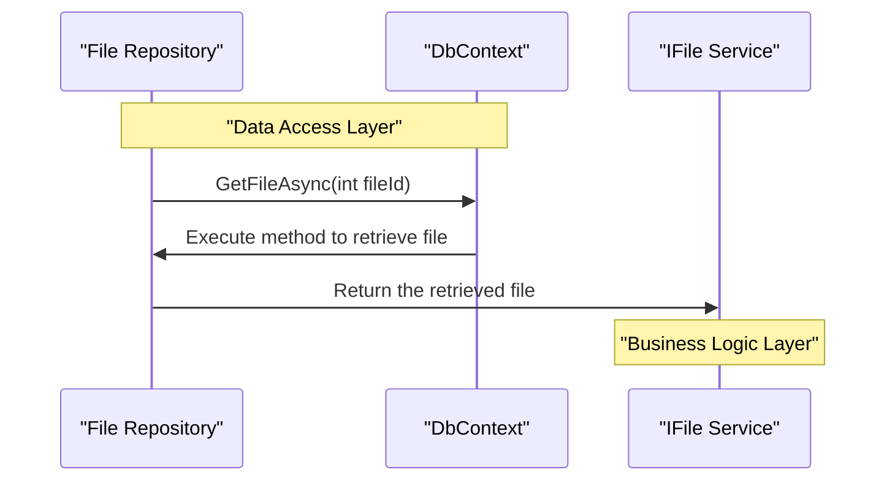

# 3. Data Access

## Relevant Source Files
* `src/Infrastructure/Data/FileItem.cs`
* `src/Web/ViewModels/File/FileViewModel.cs`
* `src/Infrastructure/Data/Migrations/CatalogContextModelSnapshot.cs`
* `src/Infrastructure/Data/Migrations/20201202111507_InitialModel.cs`
* `src/Infrastructure/Data/Migrations/20211026175614_FixBuyerId.cs`
* `src/Infrastructure/Data/Migrations/20211231093753_FixShipToAddress.cs`
* `src/Infrastructure/Data/Migrations/20250207163746_MissingMigration20250207.cs`
* `src/Infrastructure/Data/Migrations/20250310153034_Updates.cs`
* `src/Infrastructure/Data/Migrations/20201202111507_InitialModel.Designer.cs`
* `src/Infrastructure/Data/Migrations/20211026175614_FixBuyerId.Designer.cs`

## Purpose and Scope
The Data Access section provides documentation on the repository pattern, database contexts, and migrations that provide data access to the application. This module is responsible for encapsulating data access logic and providing a consistent interface for data retrieval and manipulation.

The repository pattern is used to abstract away the underlying data storage mechanism, allowing the application to work with different data sources without modifying the code. The database context provides a connection to the database, and migrations are used to create and modify the database schema as needed.

## Repository Pattern
The repository pattern is implemented in the `src/Infrastructure/Data/FileItem.cs` file using the following code snippet:
```csharp
namespace Microsoft.eShopWeb.ApplicationCore.Repositories
{
    public class FileRepository : IFileRepository
    {
        private readonly DbContext _dbContext;

        public FileRepository(DbContext dbContext)
        {
            _dbContext = dbContext;
        }

        public async Task<FileItem> GetFileAsync(int fileId)
        {
            // implementation details omitted
        }
    }
}
```
The `FileRepository` class is responsible for encapsulating the data access logic for files. It takes a `DbContext` instance in its constructor and uses it to interact with the database.

## Database Contexts and Migrations

### Initial Model (20201202111507_InitialModel.cs)

The initial model migration is used to create the database schema for the first time. The following code snippet shows the implementation:
```csharp
namespace Microsoft.eShopWeb.Infrastructure.Data.Migrations
{
    [DbContext(typeof(CatalogContext))]
    [Migration("20201202111507_InitialModel")]
    partial class InitialModel
    {
        protected override void BuildTargetModel(ModelBuilder modelBuilder)
        {
            // implementation details omitted
        }
    }
}
```
This migration creates the database schema for the application, including tables and sequences.

### Fix Buyer ID (20211026175614_FixBuyerId.cs)

The fix buyer ID migration is used to modify the database schema to include a new column for the buyer ID. The following code snippet shows the implementation:
```csharp
namespace Microsoft.eShopWeb.Infrastructure.Data.Migrations
{
    [DbContext(typeof(CatalogContext))]
    [Migration("20211026175614_FixBuyerId")]
    partial class FixBuyerId
    {
        protected override void Up(MigrationBuilder migrationBuilder)
        {
            // implementation details omitted
        }
    }
}
```
This migration adds a new column to the database table for storing the buyer ID.

### Migrations (20201202111507_InitialModel.Designer.cs and 20211026175614_FixBuyerId.Designer.cs)

The migrations are generated by the Entity Framework Core's code generation feature. The following code snippet shows an example of a migration:
```csharp
namespace Microsoft.eShopWeb.Infrastructure.Data.Migrations
{
    [DbContext(typeof(CatalogContext))]
    [Migration("20201202111507_InitialModel")]
    partial class InitialModel
    {
        protected override void BuildTargetModel(ModelBuilder modelBuilder)
        {
            modelBuilder
                .UseIdentityColumns()
                .HasAnnotation("Relational:MaxIdentifierLength", 128)
                .HasAnnotation("ProductVersion", "5.0.11")
                .HasAnnotation("SqlServer:ValueGenerationStrategy", SqlServerValueGenerationStrategy.IdentityColumn);

            modelBuilder.HasSequence("catalog_brand_hilo")
                .IncrementsBy(10);

            modelBuilder.HasSequence("catalog_hilo")
                .IncrementsBy(10);

            modelBuilder.HasSequence("catalog_type_hilo")
                .IncrementsBy(10);

            // implementation details omitted
        }
    }
}
```
The migrations are used to create and modify the database schema as needed.

### Data Access

The data access layer provides a consistent interface for data retrieval and manipulation. The following code snippet shows an example of a data access class:
```csharp
namespace Microsoft.eShopWeb.ApplicationCore.Repositories
{
    public class FileRepository : IFileRepository
    {
        private readonly DbContext _dbContext;

        public FileRepository(DbContext dbContext)
        {
            _dbContext = dbContext;
        }

        public async Task<FileItem> GetFileAsync(int fileId)
        {
            // implementation details omitted
        }
    }
}
```
The `FileRepository` class is responsible for encapsulating the data access logic for files. It takes a `DbContext` instance in its constructor and uses it to interact with the database.

### Integration with Other Components

The data access layer interacts with other components, such as the business logic layer, through interfaces and contracts. The following code snippet shows an example of an interface:
```csharp
namespace Microsoft.eShopWeb.ApplicationCore.Interfaces
{
    public interface IFileService
    {
        Task<FileItem> GetFileAsync(int fileId);
    }
}
```
The `IFileService` interface defines the contract for the file service. The data access layer implements this interface to provide a consistent interface for data retrieval and manipulation.

### Diagram

Here is a sequence diagram showing the flow of data access:

This diagram shows the flow of data access from the file repository to the business logic layer. The data access layer interacts with the database context to retrieve the file, and then returns the result to the business logic layer.

### Cross-References
For more details on the domain model, see [Domain Model](1-domain-model.md). For more information on the core services, see [Core Services](2-core-services.md).

---

**Navigation:**
[← Table of Contents](index.md) | [← 2.2. Order Service](2.2-order-service.md) | [3.1. Repository Pattern →](3.1-repository-pattern.md)

**In this section:**
- [3.1. Repository Pattern](3.1-repository-pattern.md)
- [3.2. Database Contexts and Migrations](3.2-database-contexts-and-migrations.md)