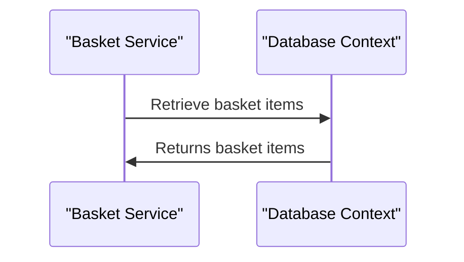
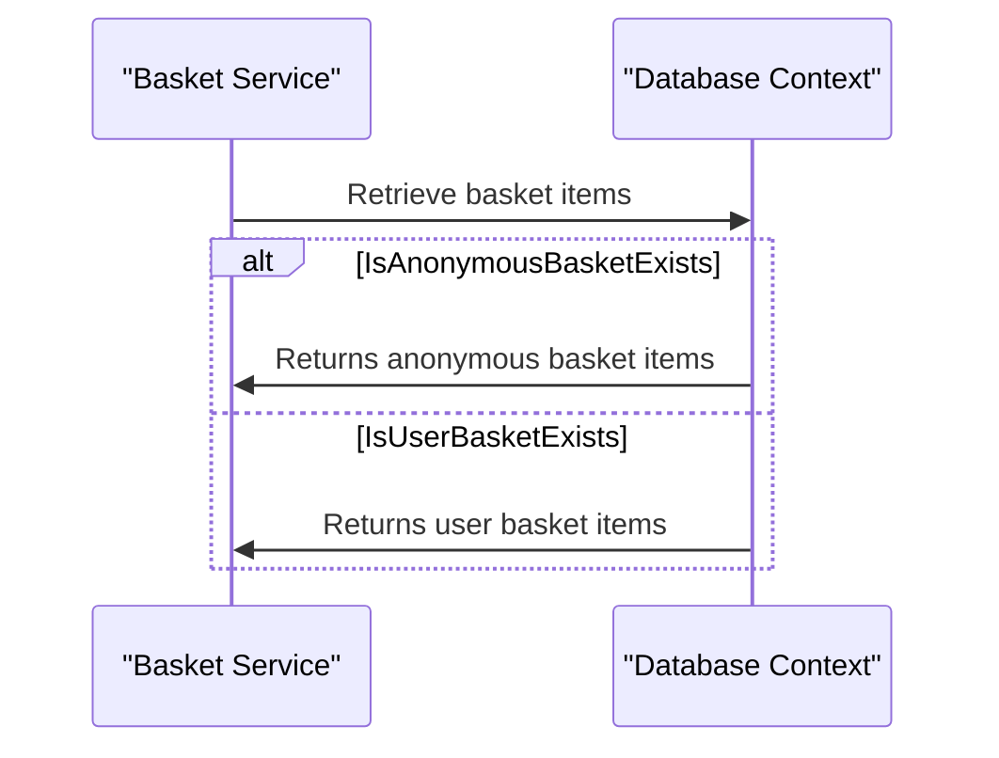

# 3.2. Database Contexts

## Relevant Source Files
- `tests/UnitTests/ApplicationCore/Services/BasketServiceTests/TransferBasket.cs`
- `src/Infrastructure/Data/FileItem.cs`
- `src/Web/ViewModels/File/FileViewModel.cs`
- `src/ApplicationCore/Entities/BaseEntity.cs`
- `src/ApplicationCore/Entities/BasketAggregate/Basket.cs`
- `src/ApplicationCore/Entities/BasketAggregate/BasketItem.cs`
- `src/ApplicationCore/Entities/BuyerAggregate/Buyer.cs`
- `src/ApplicationCore/Entities/BuyerAggregate/PaymentMethod.cs`
- `src/ApplicationCore/Entities/CatalogBrand.cs`
- `src/ApplicationCore/Entities/CatalogItem.cs`

## Purpose and Scope
The Database Contexts module provides the foundation for data access and storage in our application. It establishes connections to various databases, allowing other modules to interact with them as needed.

This module is a crucial part of our architecture, enabling the seamless integration of different components that rely on database operations. By providing a unified interface for accessing and manipulating data, we can decouple our business logic from the underlying storage mechanisms, making it easier to maintain and evolve the system.

## Database Contexts
### Connection Establishment

The connection establishment process begins by importing the necessary libraries, such as `Microsoft.EntityFrameworkCore.Storage.ValueConversion`, which provides value conversion functionality. This allows us to convert between different data types and formats when interacting with the database.

```csharp
using Microsoft.EntityFrameworkCore.Storage.ValueConversion;
```

Next, we define a method that establishes a connection to the desired database using the provided connection string. This method can be used throughout the application to connect to various databases as needed.

### Data Access

The Database Contexts module provides several methods for accessing and manipulating data in the connected database. These methods can be used by other modules to retrieve or update data, such as:

* `Then`: A method that returns a `Results<T>` object, allowing us to chain together multiple database operations.
```csharp
public Results<T> Then(Func<T> value) {
    _values.Enqueue(value);
    return this;
}
```

### Integration with Other Modules

The Database Contexts module is designed to integrate seamlessly with other modules in our application. For example, the `BasketService` module uses the database context to retrieve and update basket items.



### Mermaid Diagram

Here is a sequence diagram showing the interaction between the `BasketService` and `DatabaseContext` modules:


## Conclusion

In this wiki page, we have explored the Database Contexts module and its role in providing a unified interface for data access and storage. We have also discussed how this module integrates with other modules in our application, enabling seamless interactions between different components.

By understanding how the Database Contexts module works and interacts with other parts of our system, developers can better navigate and maintain the application's architecture, ensuring that it remains robust and scalable over time.

---

**Navigation:**
[← Table of Contents](index.md) | [← 3.1. Repository Pattern](3.1-repository-pattern.md) | [4. Web Application →](4-web-application.md)

**In this section:**
- [3.1. Repository Pattern](3.1-repository-pattern.md)