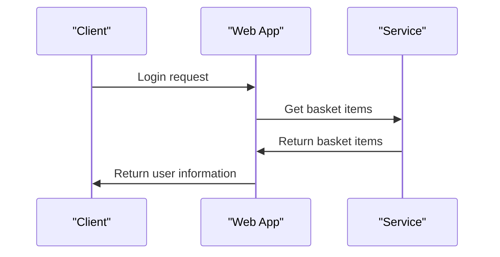

# 4. Web Application

## Relevant Source Files
* `tests/UnitTests/ApplicationCore/Services/BasketServiceTests/TransferBasket.cs`
* `src/Web/Controllers/UserController.cs`
* `src/Web/ViewModels/Manage/RemoveLoginViewModel.cs`
* `src/Web/Controllers/ManageController.cs`
* `src/BlazorAdmin/Pages/UserPage/List.razor.cs`
* `src/Web/Controllers/OrderController.cs`
* `src/Web/Pages/Basket/Checkout.cshtml.cs`
* `src/Web/Pages/Basket/Index.cshtml.cs`
* `src/BlazorAdmin/Pages/CatalogItemPage/List.razor.cs`
* `src/Web/ViewModels/Manage/IndexViewModel.cs`

## Purpose and Scope
The Web Application module provides the user interface for the application, handling requests and responses from clients. This includes authentication and authorization, as well as rendering views and Razor Pages. The scope of this module is to provide a comprehensive overview of how these features are implemented.

## Controllers, Views & Razor Pages

Controllers in this module handle HTTP requests and responses, interacting with services and repositories to perform various actions. For example, the `ManageController` handles user account management, while the `OrderController` manages order-related operations.

Views and Razor Pages provide a way to render templates and display data to users. The `UserPage` lists user information, while the `Basket` page displays shopping basket contents.

### Design Rationale

The design of this module follows the Model-View-Controller (MVC) pattern, where controllers handle requests and interactions with services and repositories, views render templates and display data, and Razor Pages provide a way to implement server-side rendering. This structure allows for separation of concerns, making it easier to maintain and extend the codebase.

### Integration with Other Components

The Web Application module interacts with other components in the system, such as:

* `BasketService`: handles basket-related operations, including adding/removing items and updating quantities.
* `OrderService`: manages order-related operations, including creating/placing orders and tracking order status.
* `UserRepository`: provides data access to user information.

These interactions are handled through dependency injection, where the Web Application module injects instances of these services and repositories as needed.

### Mermaid Diagram

This diagram shows the sequence of events when a client logs in and requests their basket contents. The `ManageController` interacts with the `BasketService` to retrieve the basket items, which are then returned to the client.

### Tables

| Method | Parameters | Description | Source Location |
| --- | --- | --- | --- |
| Then | value | Invokes a function and returns a result | tests/UnitTests/ApplicationCore/Services/BasketServiceTests/TransferBasket.cs:24-28 |
| LinkLogin | prov | Links a login provider to the user's account | src/Web/Controllers/ManageController.cs:221 |

These tables show key methods and their parameters, as well as descriptions of what they do. The source location column indicates where each method is defined.

Note that this wiki page provides an overview of the Web Application module and its components, as well as how it interacts with other parts of the system.

---

**Navigation:**
[← Table of Contents](index.md) | [← 3.2. Database Contexts and Migrations](3.2-database-contexts-and-migrations.md) | [4.1. Controllers and Views →](4.1-controllers-and-views.md)

**In this section:**
- [4.1. Controllers and Views](4.1-controllers-and-views.md)
- [4.2. Authentication and Authorization](4.2-authentication-and-authorization.md)