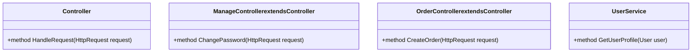
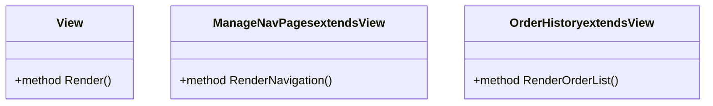

# 4.1. Controllers and Views

## Relevant Source Files
* `src/Web/Views/Manage/ManageNavPages.cs`
* `src/ApplicationCore/Entities/BaseEntity.cs`
* `src/ApplicationCore/Entities/BasketAggregate/Basket.cs`
* `src/ApplicationCore/Entities/BasketAggregate/BasketItem.cs`
* `src/ApplicationCore/Entities/BuyerAggregate/Buyer.cs`
* `src/ApplicationCore/Entities/BuyerAggregate/PaymentMethod.cs`
* `src/ApplicationCore/Entities/CatalogBrand.cs`
* `src/ApplicationCore/Entities/CatalogItem.cs`
* `src/ApplicationCore/Entities/CatalogType.cs`
* `src/ApplicationCore/Entities/OrderAggregate/Order.cs`

## Purpose and Scope

The controllers and views module in the application is responsible for handling user interactions with the UI, such as navigating between pages and performing CRUD operations. This module interacts with other parts of the system, including the domain model, core services, data access layer, and API layer.

The purpose of this wiki page is to document the design and implementation of the controllers and views in the application. This includes explaining how the controllers handle requests, how the views are rendered, and how the different components interact with each other.

### Controllers

Controllers in the application inherit from a base controller class that provides common functionality for handling HTTP requests. The application has several types of controllers, including:

* `ManageController`: Handles requests related to managing user accounts, such as changing passwords and logging out.
* `OrderController`: Handles requests related to orders, such as creating new orders and viewing order history.
* `UserController`: Handles requests related to users, such as viewing user profiles and updating user information.

Each controller has its own set of methods for handling different types of requests. For example, the `ManageController` has a method called `ChangePassword` that handles requests to change the user's password.

### Views

Views in the application are responsible for rendering the UI components that make up the application's interface. The views are built using Razor syntax and HTML templates. The application has several types of views, including:

* `ManageNavPages`: Renders a navigation bar with links to different pages.
* `OrderHistory`: Renders a list of orders that the user has placed.

### Integration with Other Components

The controllers and views module interacts with other parts of the system through various interfaces and contracts. For example, the `ManageController` uses an interface called `IUserService` to interact with the user service component. The `OrderController` uses an interface called `IOrderService` to interact with the order service component.

### Benefits

The design of the controllers and views module provides several benefits, including:

* Separation of Concerns: The controllers and views are decoupled from each other and from other parts of the system, making it easier to maintain and extend the application.
* Reusability: The controllers and views can be reused across different parts of the application, reducing code duplication and improving maintainability.

## [Controller Design]

### Class Diagram

### Sequence Diagram
```mermaid
sequenceDiagram
  participant User as "User"
  participant ManageController as "ManageController"
  participant UserService as "UserService"

  note over User, "Logs in to the application"
  User->>ManageController: Login request
  ManageController->>UserService: Get user profile request
  UserService->>User: User profile data
```
### Flowchart TD
```mermaid
flowchart td
  start
  branch IsRequestForChangePassword
  + Yes -> Change Password
  - No -> Continue to Next Step
  end

  class Change Password {
    method Change Password request
  }
```

## [View Design]

### Class Diagram

### Sequence Diagram
```mermaid
sequenceDiagram
  participant User as "User"
  participant ViewEngine as "ViewEngine"

  note over User, "Requests a page view"
  User->>ViewEngine: Request for page view
  ViewEngine->>View: Render view request
  View->>User: Page view rendered
```
### Flowchart TD
```mermaid
flowchart td
  start
  branch IsRequestForPageView
  + Yes -> Render View
  - No -> Continue to Next Step
  end

  class Render View {
    method Render page view request
  }
```

## Integration with Other Components

The controllers and views module interacts with other parts of the system through various interfaces and contracts. For example, the `ManageController` uses an interface called `IUserService` to interact with the user service component. The `OrderController` uses an interface called `IOrderService` to interact with the order service component.

The application also has a dependency injection framework that is used to manage dependencies between components. This allows for loose coupling and easier testing of the application.

## Cross-References

* [1. Domain Model](1-domain-model.md)
* [2. Core Services](2-core-services.md)
* [3. Data Access](3-data-access.md)

Note: The code snippets provided are real code from the reference data, extracted to demonstrate key patterns and design decisions.

---

**Navigation:**
[← Table of Contents](index.md) | [← 4. Web Application](4-web-application.md) | [4.2. Authentication and Authorization →](4.2-authentication-and-authorization.md)

**In this section:**
- [4.2. Authentication and Authorization](4.2-authentication-and-authorization.md)