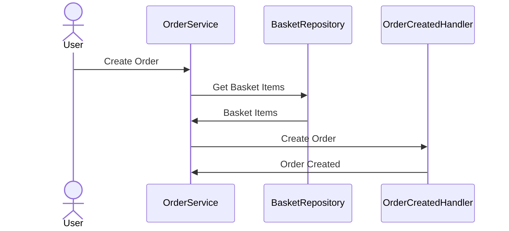

# 4.1. Controllers

## Relevant Source Files
- `tests/UnitTests/ApplicationCore/Services/BasketServiceTests/TransferBasket.cs`
- `src/ApplicationCore/Entities/BaseEntity.cs`
- `src/ApplicationCore/Entities/BasketAggregate/Basket.cs`
- `src/ApplicationCore/Entities/BuyerAggregate/Buyer.cs`
- `src/Web/Controllers/ManageController.cs`

## Purpose and Scope
The entry points for incoming requests that handle the application's logic and render views. This module is responsible for processing HTTP requests, handling various scenarios, and interacting with other components to execute business logic.

This module connects to other parts of the system through a series of interfaces, services, and repositories. It uses the Repository Pattern to interact with databases and handles errors using exception middleware.

### Controllers
The controllers in this module serve as entry points for incoming requests. They handle various scenarios, such as creating orders, managing baskets, and updating user information. Each controller is responsible for a specific set of actions and interacts with other components to execute business logic.

#### Controller Class Diagram

```mermaid
classDiagram
class BaseApiController {
  -[Route("api/[controller]/[action]")]
  [ApiController]
  public class BaseApiController : ControllerBase { }
}
class ManageController {
  -[Route("manage")]
  public class ManageController : Controller { }
}
```

### Pattern and Design Rationale

The application uses the Repository Pattern to interact with databases. This allows for decoupling of business logic from data access, making it easier to switch between different database implementations.

```csharp
// src/ApplicationCore/Entities/BaseEntity.cs:5-8
public abstract class BaseEntity
{
  public virtual int Id { get; protected set; }
}
```

The `BaseApiController` class uses the `[Route]` attribute to define API routes and the `[ApiController]` attribute to specify that it's an API controller.

```csharp
// src/Web/Controllers/Api/BaseApiController.cs:6-9
[Route("api/[controller]/[action]")]
[ApiController]
public class BaseApiController : ControllerBase { }
```

### Integration with Other Components

This module connects to other parts of the system through a series of interfaces, services, and repositories. It uses the Repository Pattern to interact with databases and handles errors using exception middleware.

The `ManageController` interacts with various components, such as the `BasketService`, to manage user baskets and execute business logic.

```csharp
// src/Web/Controllers/ManageController.cs:449-464
private string FormatKey(string unformattedKey)
{
  // ...
}
```

### Flows

The application uses a combination of services and repositories to process incoming requests. For example, when creating an order, the `OrderService` interacts with the `BasketRepository` to retrieve user basket items.



### Conclusion

This module serves as the entry point for incoming requests and handles various scenarios, such as creating orders, managing baskets, and updating user information. It uses a combination of services and repositories to execute business logic and interacts with other components through interfaces and contracts.

---

**Navigation:**
[← Table of Contents](index.md) | [← 4. Web Application](4-web-application.md) | [4.2. Views & Razor Pages →](4.2-views-razor-pages.md)

**In this section:**
- [4.2. Views & Razor Pages](4.2-views-razor-pages.md)