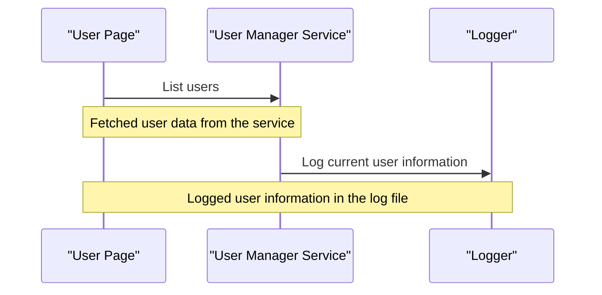

# 4.2. Views & Razor Pages

## Relevant Source Files
- `tests/UnitTests/ApplicationCore/Services/BasketServiceTests/TransferBasket.cs`
- `src/BlazorAdmin/Pages/UserPage/List.razor.cs`
- `src/BlazorAdmin/Pages/CatalogItemPage/List.razor.cs`
- `src/BlazorAdmin/Pages/RolePage/List.razor.cs`
- `tests/UnitTests/ApplicationCore/Extensions/JsonExtensions.cs`
- `tests/UnitTests/ApplicationCore/Extensions/TestParent.cs`

## Purpose and Scope
The Views & Razor Pages section of the application is responsible for rendering the user interface of the application. This module provides templates and pages that interact with the application's services, such as UserManagementService, to display data to users.

### Design Rationale

The design of this module follows a Model-View-ViewModel (MVVM) pattern, where views are Razor Pages, models represent the application's business logic, and viewmodels manage the flow of data between views and models. This allows for a clear separation of concerns and easy maintenance of the codebase.

### Architecture Overview

The Views & Razor Pages module interacts with other modules such as Core Services (e.g., UserManagementService) and Data Access (e.g., Repository Pattern). It also relies on BlazorAdmin's interfaces and helpers to integrate with the rest of the application.

## Razor Pages and Viewmodels
Razor Pages are a type of web page that integrates tightly with .NET frameworks. They provide a simpler alternative to traditional MVC-style applications, while still allowing for complex UI logic.

```csharp
namespace BlazorAdmin.Pages.UserPage;
public partial class List : BlazorComponent
{
    // ...
}
```

In the above example, the `List` Razor Page inherits from `BlazorComponent`, which is a base class that provides basic functionality for Blazor components. The page's code defines various properties and methods that interact with other modules to fetch data and render UI.

## Json Extensions and Testing
The application also relies on JSON extensions to serialize and deserialize complex objects. This allows for easy testing of the application's logic using frameworks like NUnit or xUnit.

```csharp
[Theory]
[InlineData("{ \"id\": 9, \"name\": \"Another test\" }", 9, "Another test")]
public void CorrectlyDeserializesJson(string json, int expectedId, string expectedName)
{
    // ...
}
```

In the above example, a theory-based unit test uses InlineData attributes to test JSON deserialization. The test checks if the provided JSON string is correctly deserialized into an object that matches the expected ID and name.

## Mermaid Diagram



This Mermaid sequence diagram shows the interaction between the User Page and the User Manager Service. The diagram illustrates how the User Page fetches user data from the service and logs the current user's information using a logger.

## Integration with Other Components

The Views & Razor Pages module interacts closely with other modules, such as Core Services (e.g., UserManagementService) and Data Access (e.g., Repository Pattern). This integration enables the module to provide a comprehensive UI experience for users.

---

**Navigation:**
[← Table of Contents](index.md) | [← 4.1. Controllers](4.1-controllers.md) | [5. API Layer →](5-api-layer.md)

**In this section:**
- [4.1. Controllers](4.1-controllers.md)