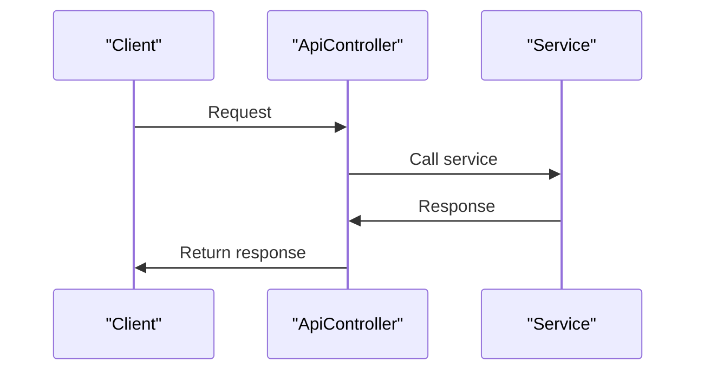

# 5. API Layer

## Relevant Source Files
- `src/Web/Controllers/Api/BaseApiController.cs`
- `src/Web/HealthChecks/ApiHealthCheck.cs`
- `tests/FunctionalTests/PublicApi/ApiTokenHelper.cs`
- `src/BlazorAdmin/Services/CatalogLookupDataService.cs`
- `src/BlazorAdmin/Services/HttpService.cs`
- `tests/PublicApiIntegrationTests/Helpers/ApiTokenHelper.cs`
- `src/BlazorShared/BaseUrlConfiguration.cs`
- `tests/FunctionalTests/PublicApi/ApiTestFixture.cs`
- `src/Web/Configuration/BaseUrlConfiguration.cs`
- `tests/PublicApiIntegrationTests/Helpers/HttpClientHelper.cs`

## Purpose and Scope
The API layer provides a set of endpoints, API controllers, and services that enable communication between the application's clients (e.g., web, mobile) and its backend services. The primary goal is to define a well-structured API that exposes a subset of the application's functionality, making it accessible to various clients.

This module fits into the overall architecture by interacting with other components, such as domain models, core services, data access layers, and UI layers. The API layer acts as an intermediary between these components, enabling them to communicate effectively.

The design of this module is centered around the idea of providing a scalable and maintainable API that can be easily extended or modified without affecting the underlying application logic. This is achieved by using established patterns such as Dependency Injection, Repository Pattern, and Domain Events.

## Endpoints and API Controllers
### Overview
The API layer consists of several endpoints and API controllers that handle various requests from clients. These endpoints are responsible for processing requests, making calls to backend services, and returning results in a standardized format.

### Code Snippets

```csharp
[src/Web/Controllers/Api/BaseApiController.cs:6-9]
[Route("api/[controller]/[action]")]
[ApiController]
public class BaseApiController : ControllerBase { }
```

This code snippet shows the basic structure of an API controller, which inherits from `BaseController` and uses the `[Route]` attribute to define its routing.

```csharp
[src/Web/HealthChecks/ApiHealthCheck.cs:11-14]
public ApiHealthCheck(IOptions<BaseUrlConfiguration> baseUrlConfiguration)
{
    _baseUrlConfiguration = baseUrlConfiguration.Value;
}
```

This code snippet demonstrates how the `ApiHealthCheck` class uses dependency injection to receive an instance of `BaseUrlConfiguration`. This allows for easy configuration and testing of the API.

### Methods
The API layer provides several methods that handle various requests, such as retrieving data or performing CRUD operations. These methods are designed to be reusable and easily testable.

```csharp
[tests/FunctionalTests/PublicApi/ApiTokenHelper.cs:11-17]
public static string GetAdminUserToken()
{
    string userName = "admin@microsoft.com";
    string[] roles = { "Administrators" };

    return CreateToken(userName, roles);
}
```

This code snippet shows a method that generates an admin user token using the `CreateToken` method.

### Tables

| Method | Description | Source Location |
| --- | --- | --- |
| GetAdminUserToken | Generates an admin user token | [tests/FunctionalTests/PublicApi/ApiTokenHelper.cs:11-17] |
| GetNormalUserToken | Generates a normal user token | [tests/FunctionalTests/PublicApi/ApiTokenHelper.cs:19-25] |

## Integration with Other Components
The API layer interacts with other components in the application, such as domain models, core services, and data access layers. These interactions are designed to be loosely coupled, making it easier to modify or extend individual components without affecting the overall system.

### Cross-References

For more information on the domain model and its entities, see [Domain Entities](2.1-entities.md).

For details on the core services and their responsibilities, see [Core Services](2-core-services.md).

## Mermaid Diagram


This Mermaid diagram illustrates the sequence of events when a client makes a request to an API controller, which then calls a backend service and returns the result to the client.

---

**Navigation:**
[← Table of Contents](index.md) | [← 4.2. Authentication and Authorization](4.2-authentication-and-authorization.md) | [5.1. Endpoints and API Controllers →](5.1-endpoints-and-api-controllers.md)

**In this section:**
- [5.1. Endpoints and API Controllers](5.1-endpoints-and-api-controllers.md)
- [5.2. API Services and Repositories](5.2-api-services-and-repositories.md)