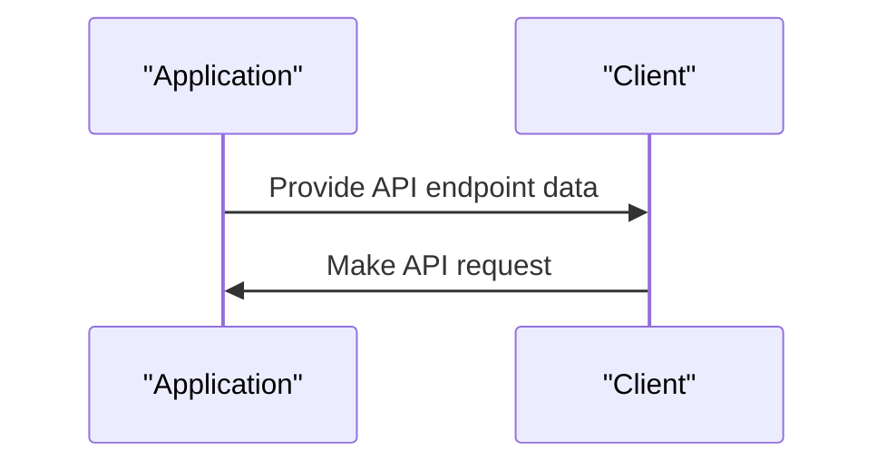

# 5.1. Endpoints and API Controllers

## Relevant Source Files
* `src/Web/Controllers/Api/BaseApiController.cs`
* `src/Web/HealthChecks/ApiHealthCheck.cs`
* `tests/FunctionalTests/PublicApi/ApiTokenHelper.cs`
* `src/Web/Controllers/UserController.cs`
* `tests/PublicApiIntegrationTests/Helpers/ApiTokenHelper.cs`
* `src/BlazorShared/BaseUrlConfiguration.cs`

## Purpose and Scope
The API Endpoints and Controllers page documents the structure and purpose of API controllers in the application. The controllers are responsible for handling API requests and providing data to clients.

The page focuses on the BaseApiController, ApiHealthCheck, UserController, and their interactions with other components.

## Endpoints and API Controllers

### Purpose and Design Rationale
API endpoints and controllers provide a way to interact with the application using RESTful APIs. The design decision is based on the principles of separation of concerns, abstraction, and scalability.

```csharp
[Route("api/[controller]/[action]")]
[ApiController]
public class BaseApiController : ControllerBase { }
```

### Controller Hierarchy

The hierarchy of controllers includes:
* `BaseApiController` (src/Web/Controllers/Api/BaseApiController.cs): A base controller that provides a common set of methods for handling API requests.
* `UserController` (src/Web/Controllers/UserController.cs): Handles user-related API requests.

### ApiHealthCheck

```csharp
public class ApiHealthCheck : IHealthCheck
{
    private readonly BaseUrlConfiguration _baseUrlConfiguration;

    public ApiHealthCheck(IOptions<BaseUrlConfiguration> baseUrlConfiguration)
    {
        _baseUrlConfiguration = baseUrlConfiguration.Value;
    }

    public async Task<HealthCheckResult> CheckHealthAsync(
        HealthCheckContext context,
        CancellationToken cancellationToken = default(CancellationToken))
    {
        // ...
    }
}
```

### UserController

```csharp
[Route("[controller]")]
[ApiController]
public class UserController : ControllerBase
{
    private readonly ITokenClaimsService _tokenClaimsService;
    private readonly SignInManager<ApplicationUser> _signInManager;
    private readonly ILogger<UserController> _logger;
    private readonly IMemoryCache _cache;

    public UserController(ITokenClaimsService tokenClaimsService,
                          SignInManager<ApplicationUser> signInManager,
                          ILogger<UserController> logger,
                          IMemoryCache cache)
    {
        // ...
    }

    [HttpGet]
    [Authorize]
    [AllowAnonymous]
    public async Task<IActionResult> GetCurrentUser() =>
        Ok(await CreateUserInfo(User));

    [Route("Logout")]
    [HttpPost]
    [Authorize]
    [AllowAnonymous]
    public async Task<IActionResult> Logout()
    {
        await _signInManager.SignOutAsync();
        await HttpContext.SignOutAsync(CookieAuthenticationDefaults.AuthenticationScheme);
        // ...
    }
}
```

### Integration with Other Components

The API endpoints and controllers interact with other components in the following ways:

* `BaseApiController` is used as a base class for other API controllers.
* `ApiHealthCheck` is responsible for checking the health of the application and providing data to clients.
* `UserController` handles user-related API requests, such as retrieving user information and handling login/logout operations.

### Cross-References

For more details on authentication and authorization, see [4.2. Authentication and Authorization](4.2-authentication-and-authorization.md).



### Conclusion

The API Endpoints and Controllers page provides an overview of the structure and purpose of API controllers in the application. The controllers are responsible for handling API requests and providing data to clients, and interact with other components in the application.

---

**Navigation:**
[← Table of Contents](index.md) | [← 5. API Layer](5-api-layer.md) | [5.2. API Services and Repositories →](5.2-api-services-and-repositories.md)

**In this section:**
- [5.2. API Services and Repositories](5.2-api-services-and-repositories.md)