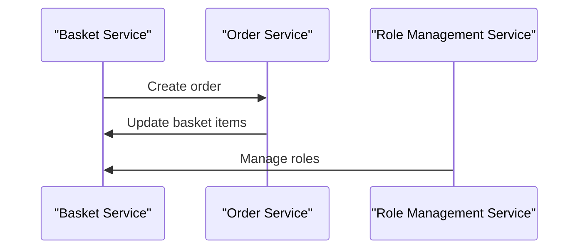

# 5.2. API Services and Repositories

## Relevant Source Files
* `src/BlazorAdmin/ServicesConfiguration.cs`
* `src/Web/Configuration/ConfigureWebServices.cs`
* `src/ApplicationCore/Services/BasketService.cs`
* `src/ApplicationCore/Interfaces/IBasketService.cs`
* `tests/IntegrationTests/Repositories/BasketRepositoryTests/SetQuantities.cs`
* `tests/UnitTests/ApplicationCore/Services/BasketServiceTests/AddItemToBasket.cs`
* `tests/UnitTests/ApplicationCore/Services/BasketServiceTests/DeleteBasket.cs`
* `src/ApplicationCore/Services/OrderService.cs`
* `src/ApplicationCore/Interfaces/IOrderService.cs`

## Purpose and Scope

The API Services module provides a set of services that enable interaction with the application's core features. This module is responsible for managing baskets, orders, and other relevant data.

### Services Configuration

The `ServicesConfiguration` class in `src/BlazorAdmin/ServicesConfiguration.cs:8-21` serves as the entry point for configuring API services. It defines methods for adding blazor services, such as cached catalog item service decorators and catalog lookup data services.

```csharp
public static IServiceCollection AddBlazorServices(this IServiceCollection services)
{
    services.AddScoped<ICatalogLookupDataService<CatalogBrand>, CachedCatalogLookupDataServiceDecorator<CatalogBrand, CatalogBrandResponse>>();
    services.AddScoped<CatalogLookupDataService<CatalogBrand, CatalogBrandResponse>>();
    // ...
}
```

### Configure Web Services

The `ConfigureWebServices` class in `src/Web/Configuration/ConfigureWebServices.cs:7-26` is responsible for configuring web services. It adds MediatR support and sets up various services.

```csharp
public static IServiceCollection AddWebServices(this IServiceCollection services, IConfiguration configuration)
{
    // Add MediatR support for the services
    services.AddMediatR(cfg =>
    {
        cfg.RegisterServicesFromAssembly(typeof(BasketViewModelService).Assembly);
        cfg.RegisterServicesFromAssembly(typeof(OrderService).Assembly);
    }
    );
    // ...
}
```

## API Services

The `BasketService` class in `src/ApplicationCore/Services/BasketService.cs:11-85` manages baskets and provides methods for adding items, deleting baskets, and updating quantities.

```csharp
public async Task<Basket> AddItemToBasket(string username, int catalogItemId, decimal price, int quantity = 1)
{
    var basketSpec = new BasketWithItemsSpecification(username);
    var basket = await _basketRepository.FirstOrDefaultAsync(basketSpec);

    if (basket == null)
    {
        basket = new Basket(username);
        await _basketRepository.AddAsync(basket);
    }

    basket.AddItem(catalogItemId, price, quantity);

    await _basketRepository.UpdateAsync(basket);
    return basket;
}
```

The `OrderService` class in `src/ApplicationCore/Services/OrderService.cs:14-59` manages orders and provides methods for creating orders, editing orders, and deleting orders.

```csharp
public async Task CreateOrderAsync(int basketId, Address shippingAddress)
{
    var basketSpec = new BasketWithItemsSpecification(basketId);
    var basket = await _basketRepository.FirstOrDefaultAsync(basketSpec);

    Guard.Against.Null(basket, nameof(basket));
    Guard.Against.EmptyBasketOnCheckout(basket.Items);

    // ...
}
```

### Integration with Other Components

The `RoleManagementService` class in `src/BlazorAdmin/Services/RoleManagementService.cs:9` manages roles and provides methods for listing roles, creating roles, editing roles, and deleting roles.

```csharp
public async Task<RoleListResponse> List()
{
    // ...
}
```

The `UserManagementService` class in `src/BlazorAdmin/Services/UserManagementService.cs:8` manages users and provides methods for creating users, updating users, and deleting users.

```csharp
public async Task CreateUserAsync(string username)
{
    // ...
}
```

### Data Access

The `BasketQueryService` class in `src/Infrastructure/Data/Queries/BasketQueryService.cs:8` provides data access to baskets and provides methods for counting basket items, retrieving basket items, and updating basket items.

```csharp
public async Task<int> CountTotalBasketItems(string username)
{
    // ...
}
```

### Mermaid Diagram

The following diagram shows the interaction between the `BasketService`, `OrderService`, and `RoleManagementService` classes.


Note that this diagram is a simplified representation of the interactions between these services and may not include all possible scenarios or edge cases.

---

**Navigation:**
[← Table of Contents](index.md) | [← 5.1. Endpoints and API Controllers](5.1-endpoints-and-api-controllers.md) | [6. Admin UI →](6-admin-ui.md)

**In this section:**
- [5.1. Endpoints and API Controllers](5.1-endpoints-and-api-controllers.md)