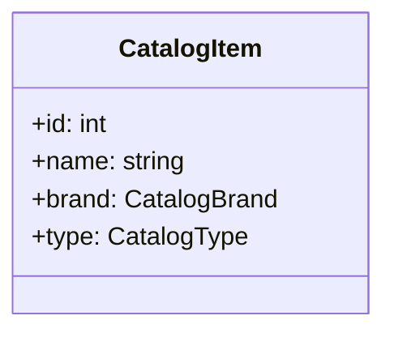

# 5.2. Catalog Endpoints

## Relevant Source Files
- `tests/UnitTests/ApplicationCore/Services/BasketServiceTests/TransferBasket.cs`
- `src/Web/Controllers/Api/BaseApiController.cs`
- `src/Web/ViewModels/Manage/RemoveLoginViewModel.cs`
- `src/BlazorAdmin/Services/CatalogLookupDataService.cs`
- `tests/FunctionalTests/PublicApi/ApiTokenHelper.cs`
- `tests/PublicApiIntegrationTests/Helpers/ApiTokenHelper.cs`
- `tests/PublicApiIntegrationTests/CatalogItemEndpoints/CatalogItemListPagedEndpoint.cs`
- `src/BlazorAdmin/Pages/CatalogItemPage/List.razor.cs`
- `src/Infrastructure/Data/CatalogContext.cs`
- `tests/UnitTests/ApplicationCore/Specifications/CatalogFilterSpecification.cs`

## Purpose and Scope
The API endpoints that provide access to the application's catalog data are a crucial part of the overall architecture. This module is responsible for exposing the catalog items, brands, and types to external services or clients. The purpose of this module is to encapsulate the business logic related to catalog data retrieval and manipulation.

## Catalog Endpoints

### Purpose and Design Rationale
The Catalog Endpoints module is designed to provide a set of APIs that allow clients to retrieve and manipulate catalog items, brands, and types. This module uses the Repository Pattern to interact with the underlying database context. The design rationale behind this module is to decouple the business logic from the data access layer, making it easier to maintain and extend.

### Endpoints

#### CatalogItemListPagedEndpoint
```mermaid
sequenceDiagram
    participant Client as "Client"
    participant Service as "Service"
    note over Service, "CatalogLookupDataService"
    Client->>Service: Get catalog items
    Service->>Repository: Retrieve catalog items
    Repository->>Service: Return catalog items
    Service->>Client: Return paged list of catalog items
```
This endpoint is responsible for retrieving a paginated list of catalog items. The client sends a request to the service, which then interacts with the repository to retrieve the desired data.

#### CatalogItemEndpoint

This endpoint is responsible for retrieving a specific catalog item by its ID. The client sends a request to the service, which then interacts with the repository to retrieve the desired data.

### Integration with Other Components

The Catalog Endpoints module integrates with other components in the following ways:

* It depends on the `CatalogLookupDataService` service to interact with the underlying database context.
* It is used by the client-side code (e.g., Blazor pages) to retrieve and manipulate catalog data.

For more details on the integration of this module with other parts of the system, see [API Layer](5-api-layer.md).

---

**Navigation:**
[← Table of Contents](index.md) | [← 5.1. Endpoint Architecture](5.1-endpoint-architecture.md) | [6. Admin UI →](6-admin-ui.md)

**In this section:**
- [5.1. Endpoint Architecture](5.1-endpoint-architecture.md)