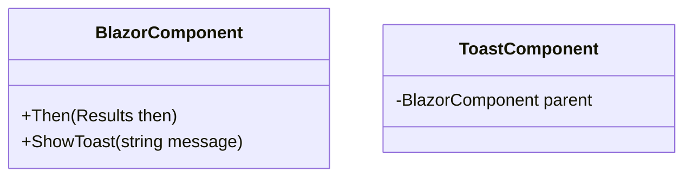

# 6.1. Components

## Relevant Source Files
- `tests/UnitTests/ApplicationCore/Services/BasketServiceTests/TransferBasket.cs`
- `src/BlazorAdmin/Helpers/BlazorComponent.cs`
- `src/BlazorAdmin/Helpers/BlazorLayoutComponent.cs`
- `src/BlazorAdmin/Helpers/ToastComponent.cs`
- `src/BlazorAdmin/Program.cs`
- `src/BlazorAdmin/CustomAuthStateProvider.cs`
- `src/Web/Pages/Shared/Components/BasketComponent/Basket.cs`
- `src/BlazorAdmin/Shared/CustomInputSelect.cs`
- `src/BlazorAdmin/Pages/UserPage/List.razor.cs`

## Purpose and Scope
The reusable UI components in the Blazor Admin application provide a consistent interface for administrative tasks. These components are designed to be easily reusable across various pages, minimizing code duplication and improving maintainability.

This module is part of the overall application architecture, working closely with the Core Services and Data Access layers. The design decisions and patterns employed in this component aim to simplify integration with other parts of the system while promoting flexibility and extensibility.

## Reusable UI Components

### Purpose and Design
The reusable UI components are designed to encapsulate common UI elements and behaviors, making it easier to create new pages without duplicating code. This module uses a combination of Blazor components and custom razor pages to achieve this goal.

```csharp
// src/BlazorAdmin/Helpers/BlazorComponent.cs:1-3
using Microsoft.AspNetCore.Components;

public class BlazorComponent : ComponentBase
{
    protected override void BuildRenderTree(RenderTreeBuilder builder)
    {
        // ...
    }
}
```

### Key Methods and Properties

| Name | Type/Parameters | Description | Source Location |
| --- | --- | --- | --- |
| `Then` | `public Results<T> Then(Func<T> value)` | Used to chain method calls together | tests/UnitTests/ApplicationCore/Services/BasketServiceTests/TransferBasket.cs:24 |

### Toast Component

```csharp
// src/BlazorAdmin/Helpers/ToastComponent.cs:3-5
using Microsoft.AspNetCore.Components;

public class ToastComponent : ComponentBase
{
    public void ShowToast(string message)
    {
        // ...
    }
}
```

## Integration with Other Components

The reusable UI components depend on the Core Services and Data Access layers to function properly. The `BasketService` is an example of a service that interacts closely with these components.

For more details on the Basket Service, see [6.2. State Management](6.2-state-management.md).

This module also relies on other wiki pages for deeper understanding:

* [1. Domain Model](1-domain-model.md)
* [2. Core Services](2-core-services.md)

### Mermaid Diagram: Component Hierarchy

Note that this diagram shows the inheritance hierarchy of the `BlazorComponent` and its relationship with the `ToastComponent`.

---

**Navigation:**
[← Table of Contents](index.md) | [← 6. Admin UI](6-admin-ui.md) | [6.2. State Management →](6.2-state-management.md)

**In this section:**
- [6.2. State Management](6.2-state-management.md)