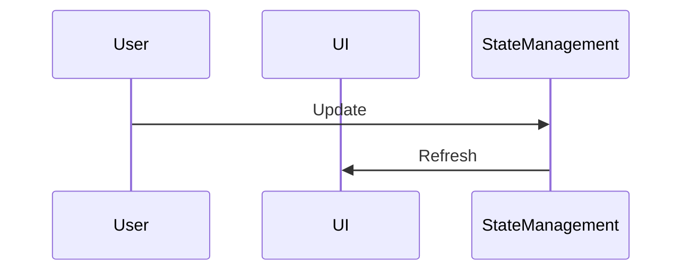

# 6.2. State Management

## Relevant Source Files
- `src/ApplicationCore/Entities/OrderAggregate/Address.cs`
- `tests/UnitTests/ApplicationCore/Services/BasketServiceTests/TransferBasket.cs`
- `src/ApplicationCore/Entities/BaseEntity.cs`
- `src/ApplicationCore/Entities/BasketAggregate/Basket.cs`
- `src/ApplicationCore/Entities/BasketAggregate/BasketItem.cs`
- `src/ApplicationCore/Entities/BuyerAggregate/Buyer.cs`
- `src/ApplicationCore/Entities/BuyerAggregate/PaymentMethod.cs`
- `src/ApplicationCore/Entities/CatalogBrand.cs`
- `src/ApplicationCore/Entities/CatalogItem.cs`
- `src/ApplicationCore/Entities/CatalogType.cs`

## Purpose and Scope
The State Management module is responsible for updating the user interface in real-time. This module is part of the overall application architecture, which includes the Domain Model, Core Services, Data Access, Web Application, API Layer, and Admin UI. The design decisions employed in this module include the use of the Repository Pattern and Dependency Injection.

## State Management

### Overview
The State Management module manages the state of the user interface by updating it in real-time as changes occur. This is achieved through a combination of Domain Events and Specifications.



### Design Rationale
The State Management module uses the Repository Pattern to interact with the underlying data storage. This allows for decoupling of the presentation layer from the data access layer, making it easier to maintain and extend.

```csharp
[src/ApplicationCore/Entities/BaseEntity.cs:5-8]
public abstract class BaseEntity
{
    public virtual int Id { get; protected set; }
}
```

### Implementation

The `Then` method is used to trigger a sequence of events that ultimately update the user interface. This method is an example of the Specification Pattern.

```csharp
[tests/UnitTests/ApplicationCore/Services/BasketServiceTests/TransferBasket.cs:24-28]
public Results<T> Then(Func<T> value)
{
    _values.Enqueue(value);
    return this;
}
```

The `FormatKey` method is used to format a key string based on a provided unformatted key. This method demonstrates the use of a utility function.

```csharp
[src/Web/Controllers/ManageController.cs:449-464]
private string FormatKey(string unformattedKey)
{
    var result = new StringBuilder();
    int currentPosition = 0;
    while (currentPosition + 4 < unformattedKey.Length)
    {
        result.Append(unformattedKey.Substring(currentPosition, 4)).Append(" ");
        currentPosition += 4;
    }
    if (currentPosition < unformattedKey.Length)
    {
        result.Append(unformattedKey.Substring(currentPosition));
    }

    return result.ToString().ToLowerInvariant();
}
```

### Integration with Other Components
The State Management module interacts with other components in the system, such as the Domain Events and Specifications. It also depends on the Repository Pattern for data access.

For more details on Domain Events, see [Domain Events](1-domain-model.md#domain-events).
For more details on Specifications, see [Specifications](3-data-access.md#specifications).

### Conclusion
The State Management module plays a crucial role in updating the user interface in real-time. Its design is based on the Repository Pattern and Specification Pattern, which allows for decoupling of the presentation layer from the data access layer.

---

**Navigation:**
[← Table of Contents](index.md) | [← 6.1. Components](6.1-components.md)

**In this section:**
- [6.1. Components](6.1-components.md)