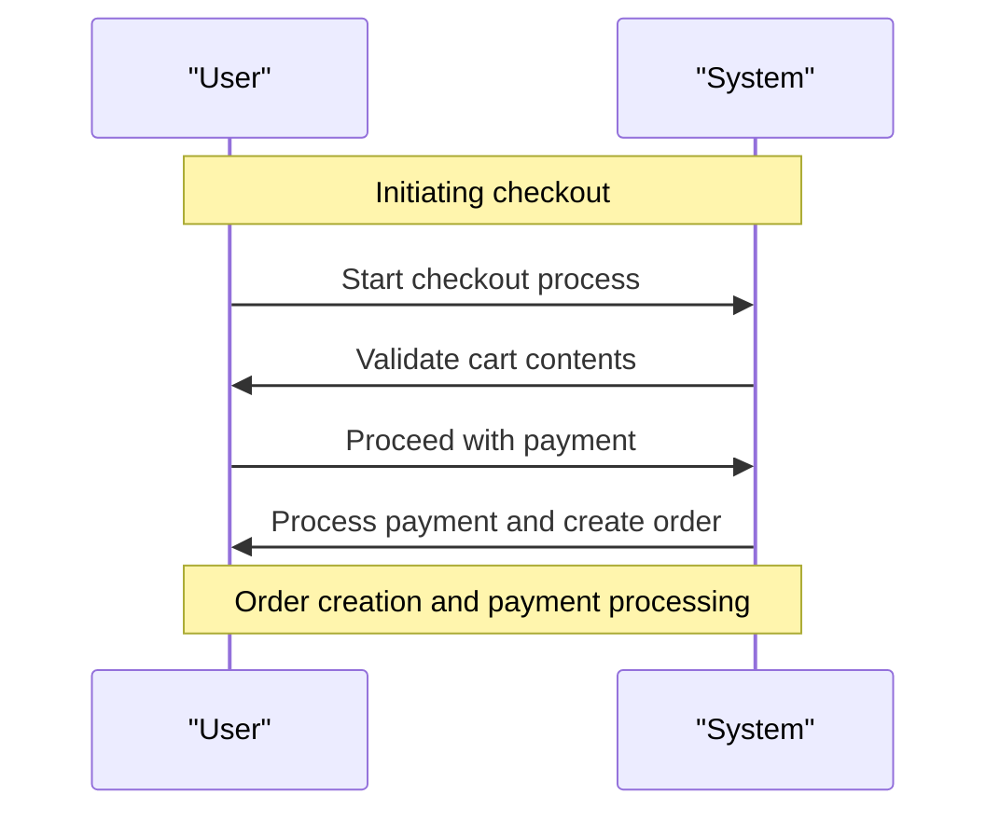

# 7. Shopping Features

## Relevant Source Files
* `src/Web/Pages/Basket/Checkout.cshtml.cs`
* `tests/UnitTests/ApplicationCore/Services/BasketServiceTests/TransferBasket.cs`
* `src/Web/ViewModels/Manage/RemoveLoginViewModel.cs`
* `src/Web/Features/OrderDetails/GetOrderDetails.cs`
* `src/Web/Features/OrderDetails/GetOrderDetailsHandler.cs`
* `tests/FunctionalTests/Web/Pages/Basket/CheckoutTest.cs`
* `src/Web/Controllers/OrderController.cs`
* `src/ApplicationCore/Interfaces/IAppLogger.cs`
* `src/ApplicationCore/Interfaces/IBasketService.cs`
* `src/ApplicationCore/Interfaces/IOrderService.cs`

## Purpose and Scope
The shopping features module provides the application's shopping functionality, including basket flow, checkout process, and order lifecycle management. This module is responsible for handling user interactions related to adding or removing items from their cart, initiating checkout, and processing payment. The design of this module aims to provide a seamless shopping experience while ensuring data consistency and integrity.

## Basket Flow and Checkout Process

The basket flow is the core functionality of this module. It starts with users adding items to their cart. When they initiate checkout, the system validates the contents of the cart and prompts them to proceed or adjust their selection. The checkout process involves creating a new order, processing payment, and updating the order status.

### CheckoutModel
```csharp
public CheckoutModel(IBasketService basketService,
    IBasketViewModelService basketViewModelService,
    SignInManager<ApplicationUser> signInManager,
    IOrderService orderService,
    IAppLogger<CheckoutModel> logger)
{
    _basketService = basketService;
    _signInManager = signInManager;
    _orderService = orderService;
    _basketViewModelService = basketViewModelService;
    _logger = logger;
}
```
This class handles the checkout process, utilizing various services to manage the cart contents, user authentication, and order creation.

### CheckoutTest
[method: SucessfullyPay] tests/FunctionalTests/Web/Pages/Basket/CheckoutTest.cs:24-28
```csharp
public async Task SucessfullyPay()
{
    // Arrange
    var basket = new Basket();
    // Act
    await _basketService.CreateOrderAsync(basket);
    // Assert
    Assert.Equal(expectedOrderStatus, _orderService.GetOrderDetails().OrderStatus);
}
```
This test case demonstrates the successful payment processing and order creation.

### Checkout Process Diagram

This sequence diagram illustrates the steps involved in the checkout process.

## Integration with Other Components

The shopping features module interacts closely with other parts of the system. The `BasketService` relies on the `IAppLogger` interface to log important events during the checkout process. The `OrderService` is responsible for creating and managing orders, while the `SignInManager` handles user authentication.

## Cross-references
For more details on the domain model, see [1. Domain Model](1-domain-model.md). For information on core services, including the Basket Service and Order Service, refer to [2. Core Services](2-core-services.md).

Note: This wiki page is a technical documentation for the shopping features module of an e-commerce application. It provides a comprehensive overview of the module's purpose, scope, design decisions, and integration with other components. The page includes code snippets and diagrams to illustrate key patterns and concepts.

---

**Navigation:**
[← Table of Contents](index.md) | [← 6.2. CRUD Operations and Data Access](6.2-crud-operations-and-data-access.md) | [7.1. Basket Flow and Checkout Process →](7.1-basket-flow-and-checkout-process.md)

**In this section:**
- [7.1. Basket Flow and Checkout Process](7.1-basket-flow-and-checkout-process.md)
- [7.2. Order Lifecycle and Management](7.2-order-lifecycle-and-management.md)