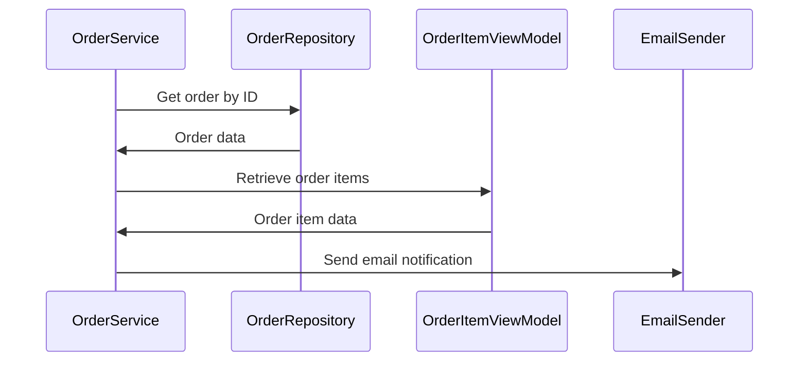

# 7.2. Order Lifecycle and Management

## Relevant Source Files
* `src/ApplicationCore/Entities/OrderAggregate/Events/OrderCreatedEvent.cs`
* `src/ApplicationCore/Services/OrderService.cs`
* `src/ApplicationCore/Specifications/OrderWithItemsByIdSpec.cs`
* `src/Web/Features/OrderDetails/GetOrderDetailsHandler.cs`
* `tests/IntegrationTests/Repositories/OrderRepositoryTests/GetByIdWithItemsAsync.cs`
* `src/Infrastructure/Data/Config/OrderConfiguration.cs`
* `src/Infrastructure/Data/Config/OrderItemConfiguration.cs`
* `src/Web/Features/OrderDetails/GetOrderDetails.cs`
* `src/Web/Controllers/OrderController.cs`
* `tests/UnitTests/MediatorHandlers/OrdersTests/GetOrderDetails.cs`

## Purpose and Scope
The Order Lifecycle Management component is responsible for managing the order lifecycle from creation to fulfillment. This includes handling events such as order created, order updated, and order canceled. The component also provides services for retrieving orders, updating order status, and sending notifications.

The OrderService class is a central part of this component, providing methods for creating, updating, and deleting orders. It uses the OrderRepository to interact with the database and the OrderWithItemsByIdSpec specification to retrieve orders based on their ID.

## Design Rationale
The design of the Order Lifecycle Management component is centered around the concept of domain events and specifications. The OrderCreatedEvent class represents the event that occurs when an order is created, and the OrderWithItemsByIdSpec class provides a way to retrieve orders based on their ID.

The OrderService class uses these domain events and specifications to provide a robust and scalable service for managing orders. It also provides methods for updating and deleting orders, as well as sending notifications.

### Handling Domain Events
```csharp
public class OrderCreatedHandler(ILogger<OrderCreatedHandler> logger, IEmailSender emailSender) : INotificationHandler<OrderCreatedEvent>
{
    public async Task Handle(OrderCreatedEvent domainEvent, CancellationToken cancellationToken)
    {
        logger.LogInformation("Order #{orderId} placed: ", domainEvent.Order.Id);

        await emailSender.SendEmailAsync("to@test.com",
                                         "Order Created",
                                         $"Order with id {domainEvent.Order.Id} was created.");
    }
}
```
This code snippet shows how the OrderCreatedHandler class handles the OrderCreatedEvent event by sending an email notification.

### Retrieving Orders using Specifications
```csharp
public class OrderWithItemsByIdSpec : Specification<Order>
{
    public OrderWithItemsByIdSpec(int orderId)
    {
        Query
            .Where(order => order.Id == orderId)
            .Include(o => o.OrderItems)
            .ThenInclude(i => i.ItemOrdered);
    }
}
```
This code snippet shows how the OrderWithItemsByIdSpec class provides a way to retrieve orders based on their ID. The specification uses LINQ to query the database and include related entities.

### Integrating with Other Components
The OrderService class integrates with other components, such as the OrderRepository and the OrderItemViewModel. It also sends notifications using an email sender service.


This sequence diagram shows the flow of data between components.

---

**Navigation:**
[← Table of Contents](index.md) | [← 7.1. Basket Flow and Checkout Process](7.1-basket-flow-and-checkout-process.md) | [8. Configuration →](8-configuration.md)

**In this section:**
- [7.1. Basket Flow and Checkout Process](7.1-basket-flow-and-checkout-process.md)