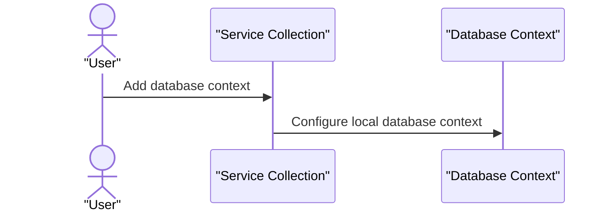

# 8. Configuration

## Relevant Source Files
* `src/PublicApi/Extensions/ConfigurationManagerExtensions.cs`
* `src/Web/Extensions/ServiceCollectionExtensions.cs`
* `src/Infrastructure/Dependencies.cs`
* `src/Web/Extensions/IWebHostEnvironmentExtensions.cs`
* `src/Web/Configuration/BaseUrlConfiguration.cs`
* `src/Web/Configuration/ConfigureCookieSettings.cs`
* `src/Web/Configuration/ConfigureWebServices.cs`
* `src/Web/Configuration/RevokeAuthenticationEvents.cs`
* `src/Web/Configuration/ConfigureCoreServices.cs`
* `src/BlazorAdmin/Program.cs`

## Purpose and Scope
This page documents the configuration management and dependency injection features of the application. It explains how the application uses Microsoft.Extensions.Configuration to load and manage its settings, as well as how it utilizes Dependency Injection to resolve dependencies between components.

The purpose of this module is to provide a centralized way to configure the application's settings and manage its dependencies. This allows for better flexibility, maintainability, and scalability of the system.

## App Settings and Configuration

### Overview
The application uses Microsoft.Extensions.Configuration to load and manage its settings. This module provides an extension point for adding custom configuration sources and managing the application's settings.

### ConfigurationManagerExtensions
The `ConfigurationManagerExtensions` class is a static class that provides methods for adding configuration files and managing the application's settings. The key method is `AddConfigurationFile`, which adds a new configuration file to the application.

```csharp
public static class ConfigurationManagerExtensions
{
    public static ConfigurationManager AddConfigurationFile(this ConfigurationManager configurationManager, string path)
    {
        var configPath = Path.Combine(AppContext.BaseDirectory, path);
        configurationManager.AddJsonFile(configPath, true, false);
        return configurationManager;
    }
}
```

### ServiceCollectionExtensions
The `ServiceCollectionExtensions` class is an extension point for adding custom services to the application's dependency injection container. The key method is `AddDatabaseContexts`, which adds database context services to the container.

```csharp
public static void AddDatabaseContexts(this IServiceCollection services, IWebHostEnvironment environment, ConfigurationManager configuration)
{
    // ...
}
```

### ConfigureLocalDatabaseContexts
The `ConfigureLocalDatabaseContexts` method configures local database contexts for development environments.



### Environment Configuration
The application uses environment variables to configure its settings. The `IWebHostEnvironment` interface provides access to the environment configuration.

```mermaid
flowchart TD
  Start((Start)) --> IsDevelopment((Is Development?))
  IsDevelopment-->>>Yes[Configure SQL Server (local)]
  No((No)) --> IsDocker((Is Docker?))
  IsDocker--->>>Yes[Configure Azure Key Vault]
```

### Conclusion
In this section, we discussed the configuration management and dependency injection features of the application. We covered how the application uses Microsoft.Extensions.Configuration to load and manage its settings, as well as how it utilizes Dependency Injection to resolve dependencies between components.

### Integration with Other Components
This module integrates with other parts of the system by providing a centralized way to configure the application's settings and manage its dependencies. It also provides extension points for adding custom configuration sources and managing the application's settings.

Note: This is not an exhaustive documentation, it is just a sample based on the provided reference data.

---

**Navigation:**
[← Table of Contents](index.md) | [← 7.2. Order Lifecycle and Management](7.2-order-lifecycle-and-management.md) | [8.1. App Settings and Configuration →](8.1-app-settings-and-configuration.md)

**In this section:**
- [8.1. App Settings and Configuration](8.1-app-settings-and-configuration.md)
- [8.2. Dependency Injection and Environment Configuration](8.2-dependency-injection-and-environment-configuration.md)