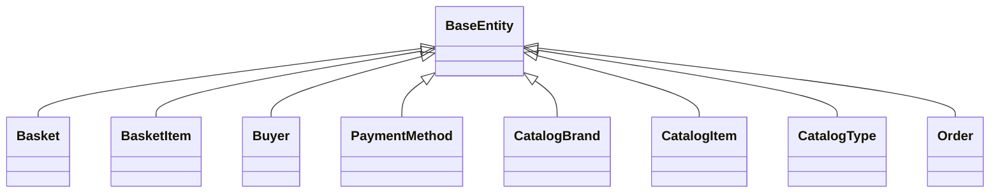

# 8.1. App Settings and Configuration

## Relevant Source Files
* `src/PublicApi/Extensions/ConfigurationManagerExtensions.cs`
* `src/ApplicationCore/Entities/BaseEntity.cs`
* `src/ApplicationCore/Entities/BasketAggregate/Basket.cs`
* `src/ApplicationCore/Entities/BasketAggregate/BasketItem.cs`
* `src/ApplicationCore/Entities/BuyerAggregate/Buyer.cs`
* `src/ApplicationCore/Entities/BuyerAggregate/PaymentMethod.cs`
* `src/ApplicationCore/Entities/CatalogBrand.cs`
* `src/ApplicationCore/Entities/CatalogItem.cs`
* `src/ApplicationCore/Entities/CatalogType.cs`
* `src/ApplicationCore/Entities/OrderAggregate/Order.cs`

## Purpose and Scope
The App Settings and Configuration module is responsible for loading and managing application settings, configuration files, and environment variables. This module provides a set of extension methods for the `ConfigurationManager` class, allowing developers to easily load configuration files from various sources.

In this architecture, the `BaseEntity` class serves as the foundation for all entity types in the domain model. This class provides a basic implementation of an entity with an `Id` property and virtual getter.

## Configuration and Extension Methods
The `ConfigurationManagerExtensions` class offers several extension methods for the `ConfigurationManager` class. The most notable method is `AddConfigurationFile`, which allows developers to add a JSON configuration file to the application's configuration manager. This method demonstrates the use of the `Path.Combine` method to construct the path to the configuration file and the `AddJsonFile` method to load the file.

```csharp
public static class ConfigurationManagerExtensions
{
    public static ConfigurationManager AddConfigurationFile(this ConfigurationManager configurationManager, string path)
    {
        var configPath = Path.Combine(AppContext.BaseDirectory, path);
        configurationManager.AddJsonFile(configPath, true, false);
        return configurationManager;
    }
}
```

## Entity Hierarchy and Inheritance

The `BaseEntity` class serves as the base type for all entities in the domain model. This inheritance hierarchy allows for code reuse and a clear separation of concerns between entity types.



## Integration with Other Components

The App Settings and Configuration module interacts closely with other components in the application, such as the domain model entities, data access repositories, and services. For example, the `BasketService` and `OrderService` classes rely on the configuration manager to load configuration files and settings.

```markdown
For more details on the Basket Service, see [Basket Service](2.1-basket-service.md).
```

This module also integrates with other wiki pages, such as:

* [Domain Model](1-domain-model.md)
* [Core Services](2-core-services.md)
* [Data Access](3-data-access.md)

---

**Navigation:**
[← Table of Contents](index.md) | [← 8. Configuration](8-configuration.md) | [8.2. Dependency Injection and Environment Configuration →](8.2-dependency-injection-and-environment-configuration.md)

**In this section:**
- [8.2. Dependency Injection and Environment Configuration](8.2-dependency-injection-and-environment-configuration.md)