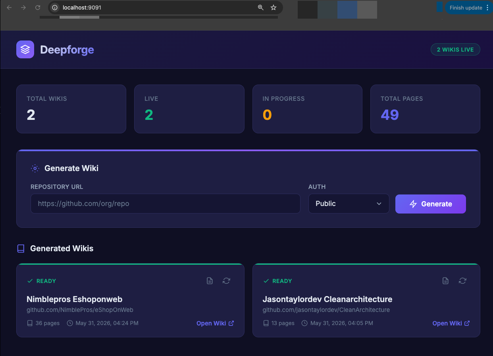

# Deepforge

Generate comprehensive wiki documentation from any code repository. Deepforge indexes your codebase into a knowledge graph using tree-sitter, then uses LLMs to produce rich documentation with architecture diagrams, code citations, and cross-linked pages.



**[Live Example: eShopOnWeb Wiki](https://wisecoders.github.io/deepforge/)** — generated from [NimblePros/eShopOnWeb](https://github.com/NimblePros/eShopOnWeb) (36 pages, 8 sections)

## Features

- **Multi-language support** — TypeScript, JavaScript, Python, C#, Go, Rust, Java, Kotlin, Swift, Ruby, PHP, C, C++
- **Knowledge graph** — Extracts symbols, relationships, call chains, and type hierarchies into a queryable SQLite graph with full-text search
- **LLM-powered generation** — Plans wiki structure based on graph analysis, generates pages with real code snippets and Mermaid diagrams
- **Multi-provider** — Claude (with prompt caching), OpenAI, Azure OpenAI, or Ollama (local)
- **Kubernetes-native** — Controller API with dashboard, per-wiki pod deployment, RBAC, progress streaming
- **Resync workflow** — Each wiki has a "Resync" button that triggers re-generation while preserving the URL

## Architecture

```
                        ┌─────────────────────────────────────────────────────────┐
                        │                 Kubernetes Cluster                       │
                        │                                                         │
  User ─── HTTP ──────► │  ┌────────────────────────────┐                         │
                        │  │  NGINX Ingress              │                         │
                        │  │  deepforge.local → ctrl     │                         │
                        │  │  <slug>.deepforge.local → wiki pods                  │
                        │  └────────┬───────────┬───────┘                         │
                        │           │           │                                  │
                        │  ┌────────▼────────┐  │  ┌──────────────────────────┐   │
                        │  │  Controller Pod  │  │  │  Wiki Pods (per-repo)   │   │
                        │  │  ─────────────── │  │  │  ────────────────────── │   │
                        │  │  Dashboard :8080 │  │  │  wiki-org-repo          │   │
                        │  │  API endpoints   │  │  │  wiki-another-repo      │   │
                        │  │  Job pipeline    │──┼─►│  wiki-...               │   │
                        │  │  kubectl apply   │  │  │  (Docsify static)       │   │
                        │  └────────┬─────────┘  │  └─────────────┬──────────┘   │
                        │           │            │                 │              │
                        │           ▼            │                 ▼              │
                        │  ┌─────────────────────┴─────────────────────────────┐  │
                        │  │  PersistentVolumeClaim (deepforge-data)            │  │
                        │  │  /data/repos/  /data/wikis/  /data/logs/           │  │
                        │  └───────────────────────────────────────────────────┘  │
                        └─────────────────────────────────────────────────────────┘
                                          │
                         ┌────────────────┼────────────────┐
                         ▼                ▼                ▼
                   ┌──────────┐   ┌─────────────┐   ┌──────────┐
                   │  GitHub  │   │ Azure DevOps│   │  Ollama  │
                   │  GitLab  │   │ Bitbucket   │   │  Claude  │
                   │  (repos) │   │  (repos)    │   │  OpenAI  │
                   └──────────┘   └─────────────┘   └──────────┘
```

> Full draw.io diagrams available in [`docs/architecture.drawio`](docs/architecture.drawio) and [`docs/pipeline-flow.drawio`](docs/pipeline-flow.drawio)

### Processing Pipeline

```
  Clone ──► Scan ──► Extract ──► Resolve ──► Store ──► Plan ──► Generate ──► Assemble ──► Deploy Pod
                     (tree-sitter) (cross-file)  (SQLite)   (LLM)    (LLM x N)   (docsify)    (kubectl)
```

| Stage | What it does | Output |
|-------|-------------|--------|
| **Scanner** | Discovers source files, detects languages, applies .gitignore rules | `SourceFile[]` |
| **Extractor** | Parses each file with tree-sitter WASM, extracts symbols + intra-file edges | `GraphNode[]`, `GraphEdge[]` |
| **Resolver** | Resolves cross-file references (imports, inheritance, type usage) | Enriched edges |
| **Store** | Persists knowledge graph in SQLite with FTS5 full-text search | Queryable graph DB |
| **Planner** | LLM analyzes the graph and plans a concept-based wiki structure | Section tree |
| **Page Writer** | LLM generates each page with code snippets, citations, Mermaid diagrams | Markdown pages |
| **Assembler** | Writes markdown + Docsify site with sidebar, search, resync button | Wiki directory |
| **Deployer** | Creates K8s Deployment + Service + Ingress for the wiki pod | Live URL |

### Project Structure

```
src/
  types.ts            All type definitions (single source of truth)
  errors.ts           Error class hierarchy
  scanner/            Source file discovery and language detection
  extraction/         Tree-sitter parsing, per-language symbol extraction
  resolution/         Cross-file reference resolution
  store/              SQLite graph storage with FTS5
  graph/              Graph traversal and query algorithms
  generator/          LLM-based wiki generation pipeline
    planner.ts          Wiki structure planning
    context-assembler.ts  Page context assembly from graph
    page-writer.ts      LLM page generation with Mermaid diagrams
    assembler.ts        Markdown + Docsify output assembly
  llm/                LLM provider abstraction (Claude, OpenAI, Azure, Ollama)
  cli/                Command-line interface
  controller/         Kubernetes controller API + wiki server
    server.ts           Controller API, dashboard, job management, K8s pod deployment
    wiki-server.ts      Static wiki file server (runs in per-wiki pods)
deploy/
  k8s/                Kubernetes manifests (kustomize)
docs/
  architecture.drawio   System architecture diagram (draw.io)
  pipeline-flow.drawio  Data pipeline flow diagram (draw.io)
wasm/                 Tree-sitter WASM grammar files
```

## Quick Start

### Local CLI Usage

```bash
# Install dependencies
npm install

# Copy and configure environment
cp .env.example .env
# Edit .env — set LLM_PROVIDER and the corresponding API key

# Build
npm run build

# Generate wiki for a local repo
npx deepforge generate /path/to/your/repo --output ./wiki

# Serve the wiki locally
cd wiki && python3 -m http.server 3000
# Open http://localhost:3000
```

### Docker (standalone)

```bash
docker build -t deepforge:latest .

docker run -d \
  --name deepforge \
  -p 8080:8080 \
  -v deepforge-data:/data \
  -e LLM_PROVIDER=ollama \
  -e OLLAMA_BASE_URL=http://host.docker.internal:11434 \
  deepforge:latest

# Open http://localhost:8080
```

## LLM Provider Configuration

Set `LLM_PROVIDER` in `.env` or pass as environment variable:

| Provider | `LLM_PROVIDER` | Required env vars | Notes |
|----------|----------------|-------------------|-------|
| **Claude** | `claude` | `ANTHROPIC_API_KEY` | Best quality. Uses prompt caching for cost reduction. |
| **OpenAI** | `openai` | `OPENAI_API_KEY` | GPT-4o default. Set `OPENAI_BASE_URL` for compatible APIs. |
| **Azure OpenAI** | `azure` | `AZURE_OPENAI_API_KEY`, `AZURE_OPENAI_ENDPOINT`, `AZURE_OPENAI_DEPLOYMENT` | Enterprise. Supports `retry-after` headers. |
| **Ollama** | `ollama` | — | Free, local models. Set `OLLAMA_BASE_URL` (default: `localhost:11434`). |

See [`.env.example`](.env.example) for all configuration options.

### Model Quality Comparison

The quality of generated wikis varies **dramatically** by model. Deepforge's pipeline sends rich graph context to the LLM — symbol relationships, code snippets with line numbers, type hierarchies, call chains — and larger models are far better at synthesizing this into coherent documentation.

| Capability | Claude Sonnet / GPT-4o | Ollama (llama3 8B) |
|------------|----------------------|---------------------|
| **Architectural narratives** | Coherent multi-paragraph explanations connecting components, patterns, and design decisions | Shorter, surface-level descriptions that list symbols without explaining relationships |
| **Mermaid diagrams** | Accurate class diagrams, sequence diagrams, and flowcharts with correct syntax | Frequently produces broken Mermaid syntax or overly simplistic diagrams |
| **Code citations** | Precise `file:line` references woven naturally into explanations | Often omits citations or references incorrect line numbers |
| **Cross-references** | Links related concepts across pages ("See [Section 3.2: Repository Pattern]") | Rarely generates meaningful cross-references |
| **Context utilization** | Leverages the full graph context (128K+ token window) — callers, callees, type hierarchies | Limited context window (4-8K) means most graph context is truncated |
| **Design pattern recognition** | Identifies and explains patterns (Repository, CQRS, Mediator, DI) from the code structure | May name patterns but struggles to explain how the code implements them |

**Our recommendation:** Use **Claude Sonnet** or **GPT-4o** for production wikis. The difference is not incremental — it's the difference between documentation you'd actually use and documentation you'd rewrite.

- **Claude Sonnet** — Best overall. Deepforge enables [prompt caching](https://docs.anthropic.com/en/docs/build-with-claude/prompt-caching) automatically, so the system prompt and graph context are cached across page generations. This cuts costs by ~60% and reduces latency. A 40-page wiki typically costs $0.50-1.50.
- **GPT-4o** — Comparable quality. Good alternative if you already have an OpenAI key.
- **Ollama** — Free and private, great for testing the pipeline or internal/non-critical docs. Use `llama3:70b` or `mixtral` for better results than the default 8B.

> The [live example wiki](https://wisecoders.github.io/deepforge/) was generated with Ollama llama3 8B. Re-generating the same repo with Claude Sonnet produces noticeably richer pages with accurate diagrams and deeper architectural analysis.

## CLI Reference

```bash
# Full pipeline: index + generate wiki
npx deepforge generate <projectPath> [options]

# Index only (build knowledge graph, no wiki)
npx deepforge index <projectPath>

# View knowledge graph stats
npx deepforge status <projectPath>

# Search the knowledge graph
npx deepforge query <projectPath> "ClassName"
```

### Generate Options

| Flag | Description | Default |
|------|-------------|---------|
| `-o, --output <path>` | Wiki output directory | `./wiki` |
| `--skip-index` | Skip indexing, use existing graph | — |
| `--provider <name>` | LLM provider override | from `.env` |
| `--model <name>` | Model name override | provider default |
| `--api-key <key>` | API key override | from `.env` |
| `--concurrency <n>` | Parallel page generation | `3` |

## Kubernetes Deployment

Deepforge runs as a controller that manages per-wiki pods:

- **Controller Pod** — Accepts repo URLs, runs the generation pipeline, deploys wiki pods via `kubectl apply`
- **Wiki Pods** — One per generated wiki, serves the Docsify site. Named `wiki-<slug>` with its own Service and Ingress

### Prerequisites

- Kubernetes cluster with an NGINX Ingress Controller
- Wildcard DNS: `*.deepforge.yourdomain.com → ingress IP`
- PersistentVolume (20Gi+ recommended)

### Deploy

```bash
# 1. Configure secrets (LLM provider + optional git credentials)
cp deploy/k8s/secrets.yaml.example deploy/k8s/secrets.yaml
vim deploy/k8s/secrets.yaml

# 2. Update domain (replace deepforge.local with your domain)
sed -i 's/deepforge.local/deepforge.yourdomain.com/g' deploy/k8s/*.yaml

# 3. Build and push the image
docker build -t myregistry/deepforge:latest .
docker push myregistry/deepforge:latest

# 4. Update image references in controller.yaml
#    Change "deepforge:latest" to "myregistry/deepforge:latest"
#    Update WIKI_IMAGE env var to match

# 5. Apply all manifests
kubectl apply -k deploy/k8s/
```

### Local Development (Docker Desktop K8s)

```bash
# Build the image
docker build -t deepforge:latest .

# Import into containerd (Docker Desktop K8s uses containerd, not Docker daemon)
docker save deepforge:latest | docker exec -i desktop-control-plane \
  ctr -n k8s.io images import --all-platforms -

# Deploy
kubectl apply -k deploy/k8s/

# Port-forward the controller
kubectl -n deepforge port-forward deploy/deepforge-controller 9091:8080

# Open http://localhost:9091
```

### What Gets Deployed

```
Namespace: deepforge
├── ServiceAccount/deepforge-controller
├── Role/deepforge-controller (manages deployments, services, ingresses)
├── RoleBinding/deepforge-controller
├── Deployment/deepforge-controller (1 replica)
├── Service/deepforge-controller (:80 → :8080)
├── Ingress/deepforge-api (deepforge.local → controller)
├── PVC/deepforge-data (20Gi, shared across all pods)
│
│  (Created dynamically per wiki:)
├── Deployment/wiki-<slug>
├── Service/wiki-<slug> (:80 → :8081)
└── Ingress/wiki-<slug> (<slug>.deepforge.local)
```

### Controller API

| Endpoint | Method | Description |
|----------|--------|-------------|
| `/` | GET | Dashboard — submit repos, view jobs, stream logs |
| `/api/generate` | POST | Submit a wiki generation job |
| `/api/jobs` | GET | List all jobs |
| `/api/jobs/:id` | GET | Get job status by ID or slug |
| `/api/jobs/:slug/logs` | GET | Stream job logs (plain text) |
| `/healthz` | GET | Health check |

#### POST /api/generate

```json
{
  "repoUrl": "https://github.com/org/repo",
  "auth": {
    "method": "pat",
    "pat": "ghp_xxxxxxxxxxxx"
  }
}
```

**Authentication options:**

| `auth.method` | Fields | Use case |
|---------------|--------|----------|
| *(omitted)* | — | Public repositories |
| `pat` | `pat` | GitHub PAT, Azure DevOps PAT |
| `service_principal` | `tenantId`, `clientId`, `clientSecret` | Azure DevOps with AAD service principal |

**Job status lifecycle:**

```
queued → cloning → indexing → generating → deploying → ready
                                                     → failed
```

Each status transition includes a `progress` field with human-readable detail, and all output is streamed to the logs endpoint.

#### Response (ready)

```json
{
  "id": "a1b2c3d4e5f6g7h8",
  "slug": "org-repo",
  "status": "ready",
  "wikiUrl": "http://org-repo.deepforge.local",
  "pages": 13,
  "progress": "Ready — 13 pages",
  "lastSyncedAt": "2026-05-31T16:05:22Z"
}
```

### Subdomain Routing

Each wiki gets a stable URL derived from the repository:

| Repository | Wiki URL |
|------------|----------|
| `github.com/NimblePros/eShopOnWeb` | `nimblepros-eshoponweb.deepforge.local` |
| `github.com/jasontaylordev/CleanArchitecture` | `jasontaylordev-cleanarchitecture.deepforge.local` |
| `dev.azure.com/org/project/_git/api` | `org-project-api.deepforge.local` |

Path-based fallback: `/wiki/<slug>/` (when wildcard DNS isn't available).

### Wiki Features

Each generated wiki includes:
- **Docsify SPA** with search plugin and sidebar navigation
- **Mermaid diagrams** — class diagrams, sequence diagrams, flowcharts
- **Code citations** — links to source files with line numbers
- **Cross-references** between pages
- **Resync banner** — shows last sync time + button to re-generate

## Development

```bash
npm run build       # Build with tsup
npm run test        # Run tests with vitest
npm run typecheck   # Type-check with tsc --noEmit
npm run lint        # Lint with eslint
```

### Adding a new language

1. Add the tree-sitter WASM grammar to `wasm/`
2. Implement `LanguageExtractor` in `src/extraction/languages/`
3. Register it in `src/extraction/languages/index.ts`
4. Add test fixtures in `__tests__/fixtures/`

## Supported Languages

| Language | Extracts |
|----------|----------|
| TypeScript / JavaScript | Classes, interfaces, functions, methods, imports, exports, type aliases |
| Python | Classes, functions, imports, decorators |
| C# | Classes, interfaces, records, methods, properties, namespaces, using directives |
| Go | Structs, interfaces, functions, methods, packages |
| Rust | Structs, traits, impls, functions, modules |
| Java | Classes, interfaces, methods, packages |
| Kotlin | Classes, interfaces, functions, data classes |
| Swift | Classes, structs, protocols, extensions |
| Ruby | Classes, modules, methods |
| PHP | Classes, interfaces, traits, functions, namespaces |
| C / C++ | Structs, classes, functions, headers |

## License

MIT
